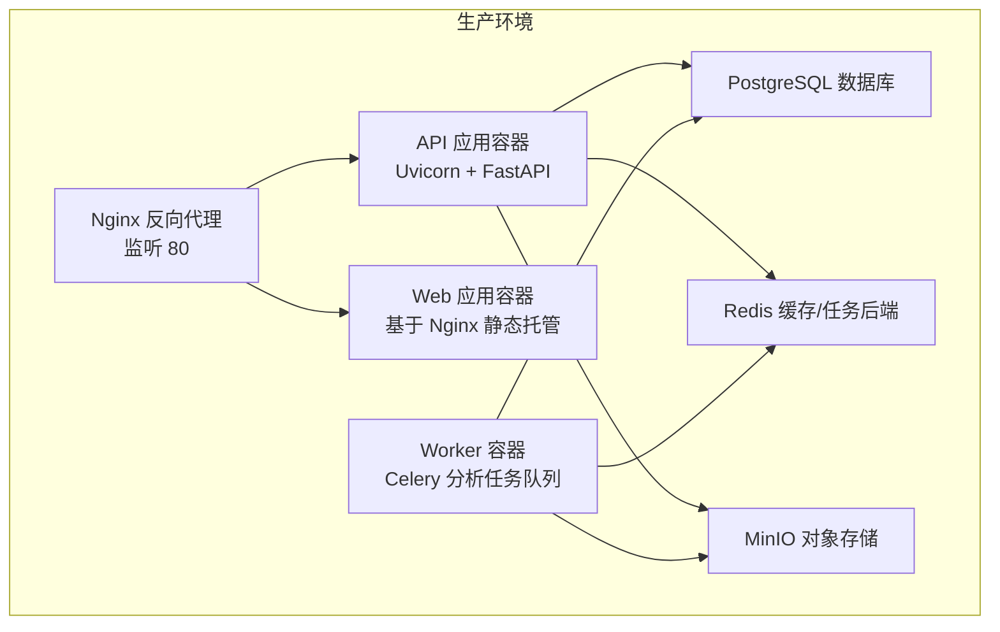
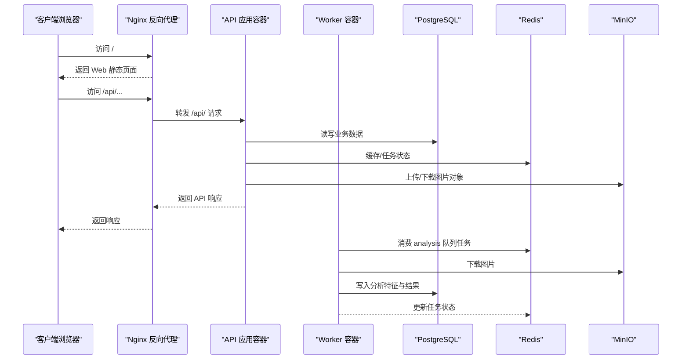
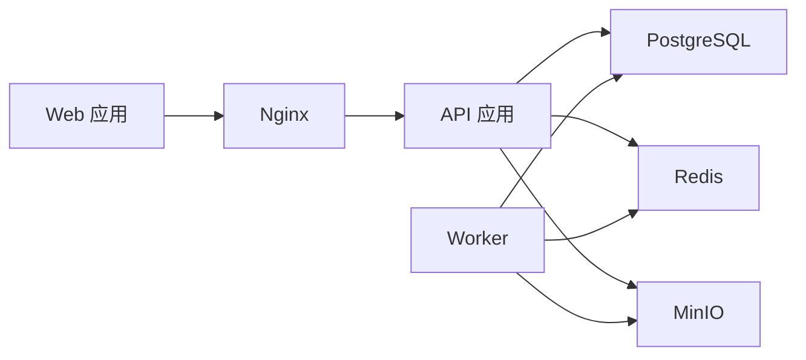

# 部署和运维

<cite>
**本文引用的文件**
- [docker-compose.prod.yml](file://infra/docker-compose.prod.yml)
- [docker-compose.yml](file://infra/docker-compose.yml)
- [default.conf](file://infra/nginx/default.conf)
- [Dockerfile（API）](file://apps/api/Dockerfile)
- [Dockerfile（Web）](file://apps/web/Dockerfile)
- [Dockerfile（Worker）](file://apps/worker/Dockerfile)
- [config.py](file://apps/api/app/core/config.py)
- [main.py](file://apps/api/app/main.py)
- [deploy.sh](file://infra/deploy.sh)
- [requirements.txt（API）](file://apps/api/requirements.txt)
- [package.json（Web）](file://apps/web/package.json)
- [analyze_photo.py](file://apps/api/app/tasks/analyze_photo.py)
- [celery_app.py](file://apps/api/app/core/celery_app.py)
</cite>

## 目录
1. [简介](#简介)
2. [项目结构](#项目结构)
3. [核心组件](#核心组件)
4. [架构总览](#架构总览)
5. [详细组件分析](#详细组件分析)
6. [依赖分析](#依赖分析)
7. [性能考虑](#性能考虑)
8. [故障排除指南](#故障排除指南)
9. [结论](#结论)
10. [附录](#附录)

## 简介
本文件面向AI摄影教练项目的生产部署与运维，覆盖以下主题：
- 生产环境部署配置：Docker容器编排、Nginx反向代理与健康检查
- CI/CD流水线建议与自动化部署流程
- 监控与日志系统搭建建议（指标采集与错误追踪）
- 容量规划与扩缩容策略
- 备份恢复、灾难恢复与高可用配置
- 运维最佳实践与故障排除
- 运维工具与脚本使用说明

## 项目结构
项目采用多服务容器化架构，包含前端Web应用、后端API、异步任务工作器、数据库、缓存与对象存储，并通过Nginx统一对外暴露HTTP服务。

图表来源
- [docker-compose.prod.yml:1-128](file://infra/docker-compose.prod.yml#L1-L128)
- [default.conf:1-30](file://infra/nginx/default.conf#L1-L30)

章节来源
- [docker-compose.prod.yml:1-128](file://infra/docker-compose.prod.yml#L1-L128)
- [docker-compose.yml:1-107](file://infra/docker-compose.yml#L1-L107)
- [default.conf:1-30](file://infra/nginx/default.conf#L1-L30)

## 核心组件
- Web 应用：使用 Nginx 静态托管构建产物，内置健康检查，作为入口页面与静态资源服务。
- API 应用：基于 Uvicorn 的 FastAPI 应用，提供 /api/v1 前缀的REST接口，包含健康检查端点。
- Worker：基于 Celery 的异步任务执行器，订阅 analysis 队列，执行图像分析任务。
- 数据层：PostgreSQL 存储业务数据；Redis 作为缓存与 Celery 任务结果后端；MinIO 提供对象存储。
- 反向代理：Nginx 将 /api/ 路由转发到 API，/healthz 路由转发到 API 健康检查，其他路径交由 Web 容器处理。

章节来源
- [Dockerfile（Web）:1-22](file://apps/web/Dockerfile#L1-L22)
- [Dockerfile（API）:1-23](file://apps/api/Dockerfile#L1-L23)
- [Dockerfile（Worker）:1-20](file://apps/worker/Dockerfile#L1-L20)
- [docker-compose.prod.yml:1-128](file://infra/docker-compose.prod.yml#L1-L128)
- [default.conf:1-30](file://infra/nginx/default.conf#L1-L30)

## 架构总览
下图展示生产环境的请求流与组件交互：

图表来源
- [default.conf:8-28](file://infra/nginx/default.conf#L8-L28)
- [docker-compose.prod.yml:60-122](file://infra/docker-compose.prod.yml#L60-L122)
- [celery_app.py:1-21](file://apps/api/app/core/celery_app.py#L1-L21)
- [analyze_photo.py:1-108](file://apps/api/app/tasks/analyze_photo.py#L1-L108)

## 详细组件分析

### Web 应用容器
- 构建方式：多阶段构建，先在 Node 环境中打包，再复制到 Nginx 镜像中进行静态托管。
- 暴露端口：80
- 健康检查：内置健康探针，便于编排器判断就绪状态。
- 配置注入：通过构建参数注入 API 基础路径，确保前端与后端路由一致。

章节来源
- [Dockerfile（Web）:1-22](file://apps/web/Dockerfile#L1-L22)
- [docker-compose.prod.yml:2-14](file://infra/docker-compose.prod.yml#L2-L14)

### API 应用容器
- 运行时：Uvicorn 启动 FastAPI 应用，监听 8000 端口。
- 路由前缀：/api/v1
- 健康检查：/healthz 端点返回健康状态。
- 中间件：CORS 允许跨域访问，来源于配置项。
- 环境变量：数据库、缓存、对象存储、模型名称、提示词版本、CORS 来源等均来自编排文件注入。

章节来源
- [Dockerfile（API）:1-23](file://apps/api/Dockerfile#L1-L23)
- [main.py:1-36](file://apps/api/app/main.py#L1-L36)
- [config.py:1-47](file://apps/api/app/core/config.py#L1-L47)
- [docker-compose.prod.yml:60-96](file://infra/docker-compose.prod.yml#L60-L96)

### Worker 容器
- 运行时：Celery worker，绑定 analysis 队列。
- 任务实现：run_analysis_task 从存储下载图片，调用特征提取、LLM 分析、编辑规划与结果合成，最终写回数据库并更新任务状态。
- 依赖：Redis 作为消息代理与结果后端，PostgreSQL 与 MinIO 作为数据与对象存储后端。

章节来源
- [Dockerfile（Worker）:1-20](file://apps/worker/Dockerfile#L1-L20)
- [celery_app.py:1-21](file://apps/api/app/core/celery_app.py#L1-L21)
- [analyze_photo.py:1-108](file://apps/api/app/tasks/analyze_photo.py#L1-L108)
- [docker-compose.prod.yml:98-122](file://infra/docker-compose.prod.yml#L98-L122)

### 数据与缓存组件
- PostgreSQL：持久化业务数据，健康检查基于 pg_isready。
- Redis：缓存与 Celery 结果后端，健康检查基于 redis-cli ping。
- MinIO：S3 兼容的对象存储，健康检查基于 /minio/health/live。

章节来源
- [docker-compose.prod.yml:16-58](file://infra/docker-compose.prod.yml#L16-L58)

### Nginx 反向代理
- 路由规则：
  - /api/ → 转发到 API:8000/api/
  - /healthz → 转发到 API:8000/healthz
  - 其他路径 → 交由 Web 容器返回静态页面
- 请求头透传：Host、X-Real-IP、X-Forwarded-For、X-Forwarded-Proto

章节来源
- [default.conf:1-30](file://infra/nginx/default.conf#L1-L30)

### 部署脚本与自动化
- 脚本职责：校验必要命令与环境文件，读取生产环境变量，启动编排栈并输出常用运维命令与预期访问地址。
- 关键要求：SERVER_IP、数据库与对象存储凭据等必须在环境文件中配置完整。

章节来源
- [deploy.sh:1-63](file://infra/deploy.sh#L1-L63)

## 依赖分析
- 组件耦合：
  - API 依赖数据库、缓存与对象存储；Worker 同样依赖缓存与对象存储；二者共享 Redis 作为消息通道。
  - Web 仅依赖 Nginx 与静态资源，不直接依赖后端服务。
- 外部依赖：
  - Python 依赖集中在 API 应用，包含 FastAPI、SQLAlchemy、Celery、Redis、Boto3、Pydantic Settings 等。
  - 前端依赖 Vue 3、Pinia、Axios、Vue Router 等。

图表来源
- [docker-compose.prod.yml:1-128](file://infra/docker-compose.prod.yml#L1-L128)

章节来源
- [requirements.txt（API）:1-19](file://apps/api/requirements.txt#L1-L19)
- [package.json（Web）:1-26](file://apps/web/package.json#L1-L26)

## 性能考虑
- 并发与资源：
  - API 使用 Uvicorn，建议根据 CPU 核数与内存配置 workers 与进程数，避免过度竞争导致上下文切换开销。
  - Worker 数量应与分析任务并发度匹配，结合 Redis 队列长度与任务耗时评估。
- 缓存策略：
  - 利用 Redis 缓存热点数据与任务中间结果，降低数据库压力。
- I/O 优化：
  - MinIO 与 PostgreSQL 的网络延迟与吞吐对整体性能影响较大，建议与应用容器在同一可用区内部署。
- 健康检查与弹性：
  - 编排文件已配置健康检查与重启策略，建议配合自动伸缩与负载均衡实现高可用。

## 故障排除指南
- 健康检查失败
  - API /healthz：确认 API 容器内服务已启动且端口可达。
  - 数据库/缓存/对象存储：检查对应容器健康检查是否通过。
- CORS 问题
  - 确认配置中的 CORS 来源列表包含前端域名与端口。
- 任务未执行
  - 检查 Redis 是否正常，Worker 是否连接成功，队列名称是否正确。
- 日志定位
  - 使用部署脚本提供的命令查看 API 与 Web 容器日志，定位异常堆栈与错误信息。
- 端口冲突
  - 确保宿主机 80（Web/Nginx）、8000（API）、6379（Redis）、5432（PostgreSQL）、9000/9001（MinIO）未被占用。

章节来源
- [deploy.sh:53-63](file://infra/deploy.sh#L53-L63)
- [docker-compose.prod.yml:25-29](file://infra/docker-compose.prod.yml#L25-L29)
- [docker-compose.prod.yml:37-41](file://infra/docker-compose.prod.yml#L37-L41)
- [docker-compose.prod.yml:53-57](file://infra/docker-compose.prod.yml#L53-L57)
- [docker-compose.prod.yml:85-95](file://infra/docker-compose.prod.yml#L85-L95)

## 结论
本项目提供了清晰的容器化部署方案与基础的反向代理、任务队列与数据存储架构。建议在生产环境中进一步完善 CI/CD 流水线、监控与日志体系、容量规划与灾备策略，并结合负载均衡与自动伸缩实现高可用与弹性扩展。

## 附录

### CI/CD 流水线建议
- 触发条件：代码推送至主分支或打标签
- 步骤建议：
  - 代码检出与依赖安装
  - 单元测试与集成测试
  - 构建镜像（Web、API、Worker）
  - 推送镜像到镜像仓库
  - 应用编排（可选：先滚动更新 API/Worker，再更新 Web）
- 回滚策略：支持按镜像版本回滚，保留最近 N 个版本

[本节为概念性建议，无需“章节来源”]

### 监控与日志系统建议
- 指标采集：
  - API：请求量、响应时间、错误率、队列长度、任务执行时延
  - Worker：任务成功率、重试次数、队列积压
  - 基础设施：CPU、内存、磁盘、网络、数据库连接数
- 错误追踪：
  - 结构化日志（JSON），包含请求ID、用户ID、时间戳、错误堆栈
  - 集成 APM（如 OpenTelemetry）与告警平台
- 日志存储：
  - Web/API/Worker 日志集中采集与归档，保留周期按法规要求设定

[本节为概念性建议，无需“章节来源”]

### 容量规划与扩缩容策略
- 规模估算：
  - API：按峰值 QPS 与 P95 延迟估算实例数与资源配额
  - Worker：按任务积压与单任务耗时估算实例数
  - 数据库：读写分离与只读副本，分库分表策略视数据规模而定
- 扩缩容：
  - 基于 CPU/内存/队列长度触发自动扩缩容
  - 采用蓝绿/滚动发布降低变更风险

[本节为概念性建议，无需“章节来源”]

### 备份恢复与灾难恢复
- 数据备份：
  - PostgreSQL：逻辑备份（如 pg_dump）与物理备份（如快照）
  - Redis：RDB/AOF 或持久化策略调整
  - MinIO：定期导出桶内容
- 恢复演练：
  - 定期进行备份恢复演练，验证恢复时间目标（RTO）与恢复点目标（RPO）
- 灾难恢复：
  - 多可用区部署，跨区复制与故障转移机制

[本节为概念性建议，无需“章节来源”]

### 运维最佳实践
- 环境隔离：开发/测试/预发布/生产严格分离
- 凭据管理：使用密钥管理服务或编排文件加密
- 版本治理：镜像与配置版本化，变更审批与灰度发布
- 安全加固：最小权限原则、网络隔离、TLS 终止与安全扫描

[本节为概念性建议，无需“章节来源”]

### 运维工具与脚本使用说明
- 部署脚本
  - 用途：校验环境、启动编排栈、输出常用运维命令与访问地址
  - 使用：准备生产环境变量文件，执行脚本
- 常用命令
  - 查看服务状态与日志
  - 访问健康检查端点
  - 进入容器排查问题

章节来源
- [deploy.sh:1-63](file://infra/deploy.sh#L1-L63)