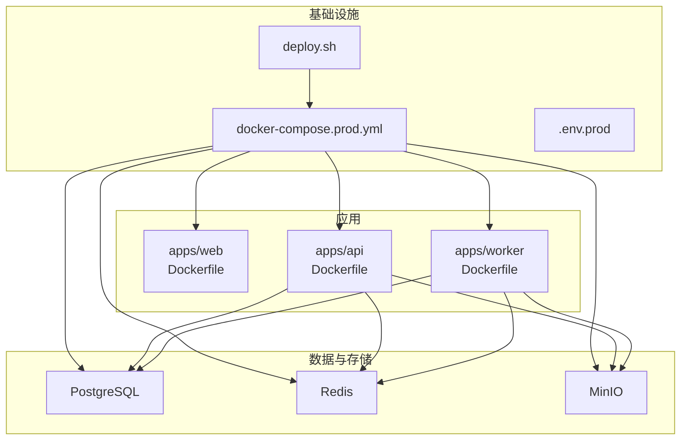
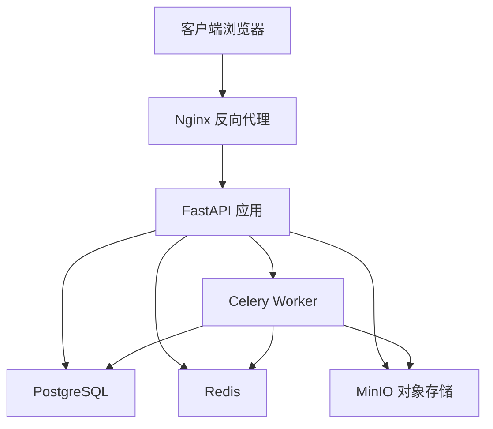
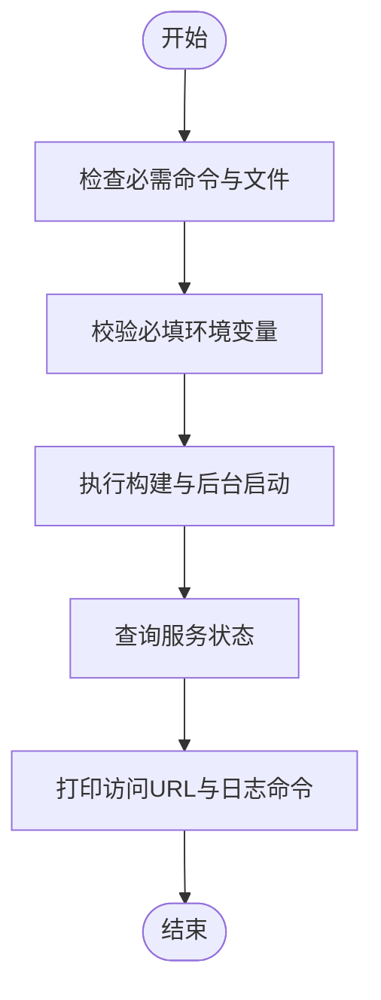
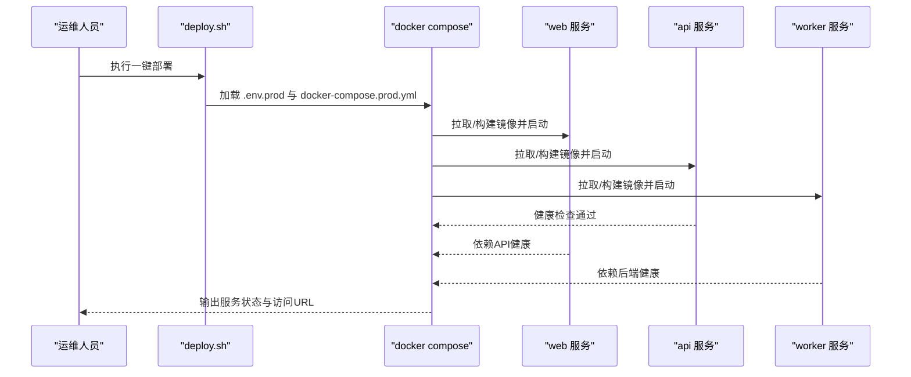
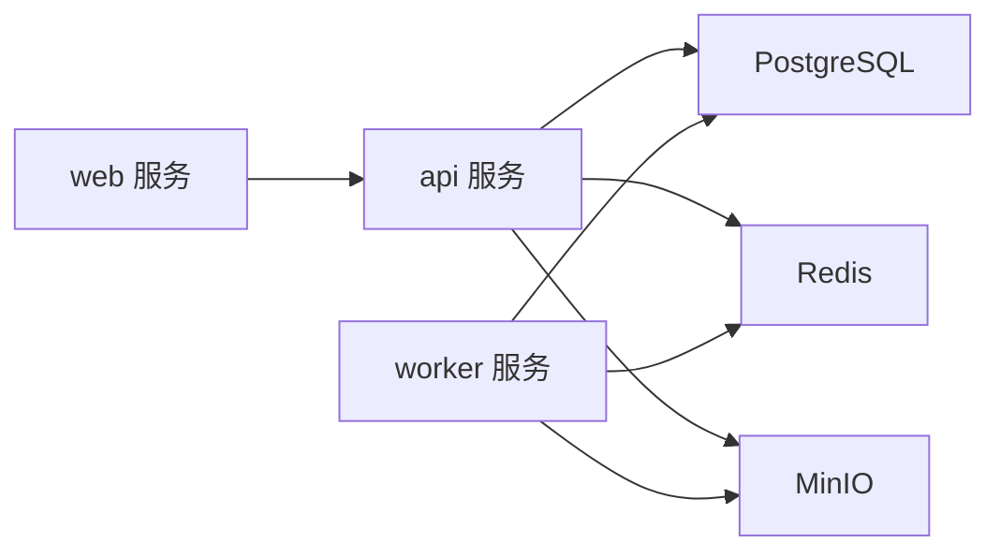

# 部署脚本和自动化

<cite>
**本文档引用的文件**
- [deploy.sh](file://infra/deploy.sh)
- [docker-compose.prod.yml](file://infra/docker-compose.prod.yml)
- [docker-compose.yml](file://infra/docker-compose.yml)
- [Dockerfile（API）](file://apps/api/Dockerfile)
- [Dockerfile（Web）](file://apps/web/Dockerfile)
- [Dockerfile（Worker）](file://apps/worker/Dockerfile)
- [requirements.txt（API）](file://apps/api/requirements.txt)
- [alembic.ini](file://apps/api/alembic.ini)
- [README.md](file://README.md)
</cite>

## 目录
1. [简介](#简介)
2. [项目结构](#项目结构)
3. [核心组件](#核心组件)
4. [架构总览](#架构总览)
5. [详细组件分析](#详细组件分析)
6. [依赖关系分析](#依赖关系分析)
7. [性能考虑](#性能考虑)
8. [故障排查指南](#故障排查指南)
9. [结论](#结论)
10. [附录](#附录)

## 简介
本文件面向AI摄影教练项目的运维与开发团队，系统化阐述生产环境部署脚本与自动化流程，涵盖环境准备、数据库迁移、容器编排与重启、CI/CD策略、版本管理与回滚、一键部署与环境切换、部署前后检查清单以及蓝绿部署与滚动更新策略的实现思路。文档以仓库中现有的部署脚本与Compose配置为基础，结合API应用的健康检查与数据库迁移工具，给出可操作的实践建议。

## 项目结构
项目采用多模块单体仓库布局，前端、后端与任务执行器分别位于独立的应用目录，并通过统一的基础设施层进行编排。生产环境使用Compose进行编排，配合一键部署脚本完成构建与启动。

图表来源
- [docker-compose.prod.yml:1-128](file://infra/docker-compose.prod.yml#L1-L128)
- [deploy.sh:1-63](file://infra/deploy.sh#L1-L63)
- [Dockerfile（Web）:1-22](file://apps/web/Dockerfile#L1-L22)
- [Dockerfile（API）:1-23](file://apps/api/Dockerfile#L1-L23)
- [Dockerfile（Worker）:1-20](file://apps/worker/Dockerfile#L1-L20)

章节来源
- [docker-compose.prod.yml:1-128](file://infra/docker-compose.prod.yml#L1-L128)
- [deploy.sh:1-63](file://infra/deploy.sh#L1-L63)

## 核心组件
- 一键部署脚本：负责校验环境、加载环境变量、调用Compose进行构建与后台启动，并输出后续常用命令与访问地址。
- 生产Compose编排：定义Web、API、Worker、PostgreSQL、Redis、MinIO等服务及其依赖、健康检查与资源卷。
- 应用镜像构建：分别基于Node与Python基础镜像构建Web前端静态站点与API/Worker服务。
- 数据库迁移：通过Alembic在API容器内执行数据库模式迁移（需结合实际部署流程）。

章节来源
- [deploy.sh:10-47](file://infra/deploy.sh#L10-L47)
- [docker-compose.prod.yml:1-128](file://infra/docker-compose.prod.yml#L1-L128)
- [Dockerfile（Web）:1-22](file://apps/web/Dockerfile#L1-L22)
- [Dockerfile（API）:1-23](file://apps/api/Dockerfile#L1-L23)
- [Dockerfile（Worker）:1-20](file://apps/worker/Dockerfile#L1-L20)
- [alembic.ini:1-147](file://apps/api/alembic.ini#L1-L147)

## 架构总览
生产环境采用容器化微服务架构，API作为核心服务，提供REST接口与健康检查；Web通过Nginx对外提供静态页面；Worker通过Celery异步处理分析任务；PostgreSQL、Redis与MinIO分别承担持久化、缓存与对象存储。

图表来源
- [docker-compose.prod.yml:1-128](file://infra/docker-compose.prod.yml#L1-L128)
- [Dockerfile（Web）:1-22](file://apps/web/Dockerfile#L1-L22)
- [Dockerfile（API）:1-23](file://apps/api/Dockerfile#L1-L23)
- [Dockerfile（Worker）:1-20](file://apps/worker/Dockerfile#L1-L20)

## 详细组件分析

### 一键部署脚本（deploy.sh）
功能概述
- 环境校验：检查必需命令、环境文件与Compose文件是否存在。
- 必填变量校验：确保SERVER_IP、数据库与S3相关变量已配置。
- 执行部署：以环境文件与Compose文件为参数，执行构建与后台启动。
- 输出提示：打印当前服务状态、日志查看命令与预期访问URL。

图表来源
- [deploy.sh:10-62](file://infra/deploy.sh#L10-L62)

章节来源
- [deploy.sh:10-62](file://infra/deploy.sh#L10-L62)

### 生产编排（docker-compose.prod.yml）
服务与依赖
- Web：基于Nginx提供静态站点，监听80端口，依赖API健康。
- API：FastAPI应用，暴露8000端口，设置数据库、缓存与S3连接信息，具备健康检查。
- Worker：Celery工作进程，订阅分析队列，依赖所有后端服务健康。
- PostgreSQL：持久化数据库，挂载卷，健康检查。
- Redis：缓存与消息队列，健康检查。
- MinIO：S3兼容的对象存储，健康检查。

图表来源
- [deploy.sh:46-62](file://infra/deploy.sh#L46-L62)
- [docker-compose.prod.yml:1-128](file://infra/docker-compose.prod.yml#L1-L128)

章节来源
- [docker-compose.prod.yml:1-128](file://infra/docker-compose.prod.yml#L1-L128)

### 应用镜像构建
- Web镜像：基于Node构建产物，使用Nginx提供静态服务，内置健康检查。
- API镜像：基于Python，安装依赖后以Uvicorn运行FastAPI应用。
- Worker镜像：复用API依赖，以Celery worker方式运行指定队列。

章节来源
- [Dockerfile（Web）:1-22](file://apps/web/Dockerfile#L1-L22)
- [Dockerfile（API）:1-23](file://apps/api/Dockerfile#L1-L23)
- [Dockerfile（Worker）:1-20](file://apps/worker/Dockerfile#L1-L20)

### 数据库迁移（Alembic）
- 配置位置：API应用内配置文件指向迁移脚本目录。
- 运行方式：可在API容器内执行迁移命令，或在部署脚本中集成迁移步骤。
- 版本控制：迁移脚本随代码版本管理，确保数据库演进与应用一致。

章节来源
- [alembic.ini:1-147](file://apps/api/alembic.ini#L1-L147)

### 健康检查与重启
- API健康检查：通过HTTP端点探测，确保服务可用。
- 后端服务健康检查：PostgreSQL、Redis、MinIO均配置健康检查。
- 重启策略：unless-stopped，保证容器异常退出后自动恢复。

章节来源
- [docker-compose.prod.yml:25-96](file://infra/docker-compose.prod.yml#L25-L96)

## 依赖关系分析
- 服务间依赖：Web依赖API健康；API与Worker依赖PostgreSQL、Redis、MinIO健康。
- 外部依赖：Docker与Compose、Python/Node运行时、数据库驱动与对象存储客户端。
- 环境变量：SERVER_IP、数据库凭据、S3访问密钥与桶名等。

图表来源
- [docker-compose.prod.yml:1-128](file://infra/docker-compose.prod.yml#L1-L128)

章节来源
- [docker-compose.prod.yml:1-128](file://infra/docker-compose.prod.yml#L1-L128)

## 性能考虑
- 资源隔离：为各服务设置合理的CPU与内存限制，避免资源争用。
- 缓存优化：利用Redis缓存热点数据与中间结果，降低数据库压力。
- 存储优化：对象存储分层策略与生命周期管理，减少冷数据占用。
- 并发与队列：Celery队列长度与并发数根据任务类型动态调整。
- 网络与负载：反向代理与健康检查配合，确保流量仅转发到健康实例。

## 故障排查指南
常见问题与定位步骤
- 容器无法启动：检查对应服务的健康检查失败原因，查看日志。
- API不可达：确认API健康检查端点是否返回成功，核对网络连通性与端口映射。
- 数据库连接失败：核对数据库凭据与网络策略，确认PostgreSQL健康。
- 对象存储异常：检查S3端点、密钥与桶名配置，确认MinIO健康。
- 日志查看：使用一键部署脚本输出的日志命令快速定位问题。

章节来源
- [deploy.sh:56-62](file://infra/deploy.sh#L56-L62)
- [docker-compose.prod.yml:25-96](file://infra/docker-compose.prod.yml#L25-L96)

## 结论
本项目已具备完善的生产级容器化部署能力：一键部署脚本、标准化Compose编排、健康检查与重启策略、清晰的服务依赖关系。结合数据库迁移工具与日志查看指引，可实现稳定高效的交付与运维。建议在此基础上进一步完善CI/CD流水线与版本回滚策略，以提升发布效率与安全性。

## 附录

### CI/CD流水线配置与自动化部署策略
- 触发条件：代码推送至主分支或打标签触发流水线。
- 构建阶段：拉取最新代码，构建Web、API与Worker镜像并推送至镜像仓库。
- 部署阶段：在目标主机执行一键部署脚本，自动拉起新版本服务。
- 回滚策略：支持一键回滚至上一个版本镜像，或通过Compose切换服务镜像标签。
- 健康检查：部署完成后执行健康检查，失败则自动回滚。
- 安全加固：镜像扫描、密钥注入与只读根文件系统等安全措施。

### 版本管理与回滚机制
- 版本标识：镜像标签采用语义化版本或提交哈希，便于追踪。
- 回滚路径：通过修改Compose中的镜像标签快速回滚，或使用容器历史对比进行精细化回滚。
- 数据迁移：数据库迁移脚本需幂等，回滚时注意数据一致性。

### 一键部署与环境切换脚本使用指南
- 环境准备：安装Docker与Compose，准备环境变量文件。
- 执行部署：在基础设施目录执行一键部署脚本，等待服务启动。
- 环境切换：通过切换环境变量文件与Compose文件实现不同环境的快速切换。
- 验证部署：访问健康检查端点与首页，确认服务正常。

章节来源
- [deploy.sh:10-62](file://infra/deploy.sh#L10-L62)
- [docker-compose.yml:1-107](file://infra/docker-compose.yml#L1-L107)
- [README.md:145-205](file://README.md#L145-L205)

### 部署前检查清单
- Docker与Compose可用性：确保Docker守护进程运行且Compose可用。
- 环境变量完整性：SERVER_IP、数据库与S3相关变量均已正确配置。
- 端口与防火墙：宿主机80端口未被占用，防火墙放行必要端口。
- 存储卷权限：数据卷目录具备写入权限，避免容器启动失败。
- 网络连通性：容器间网络互通，DNS解析正常。

### 部署后验证步骤
- 访问首页：确认Web服务可访问。
- 健康检查：访问健康检查端点，确认API服务可用。
- 日志检查：查看API、数据库与对象存储日志，确认无异常。
- 功能测试：执行关键业务流程，验证核心功能正常。

### 蓝绿部署与滚动更新策略
- 蓝绿部署：维护两套完全相同的生产环境，通过反向代理切换流量，实现零停机切换与快速回滚。
- 滚动更新：逐批替换旧版本容器，保持服务可用性，适合对停机时间敏感的场景。
- 健康检查：在切换或更新过程中严格依赖健康检查，失败则中断并回滚。