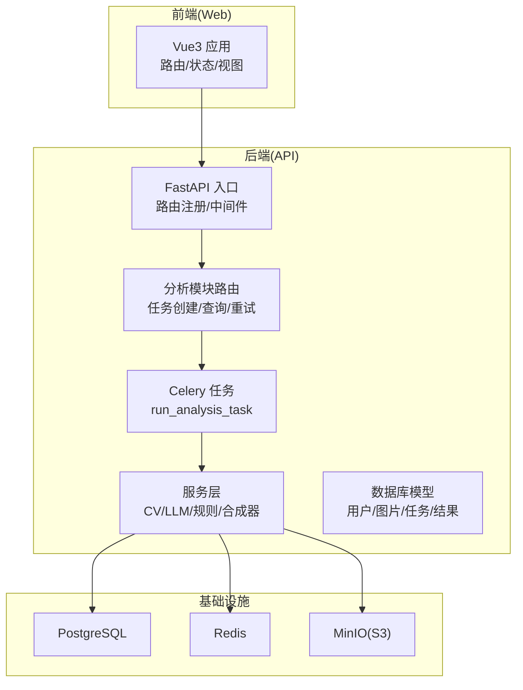
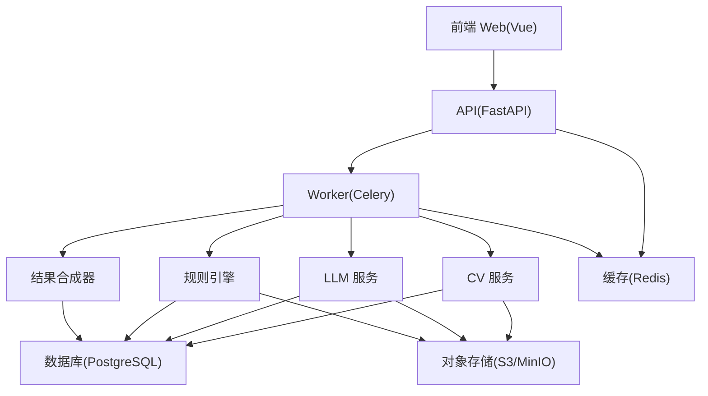
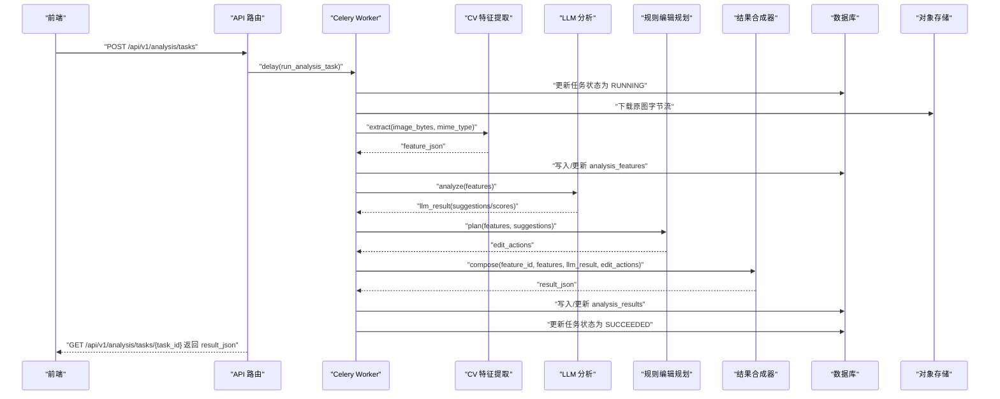
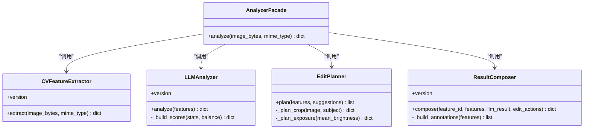
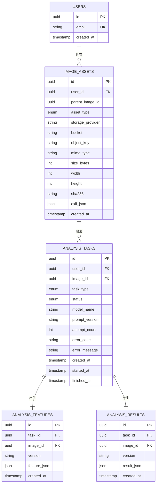
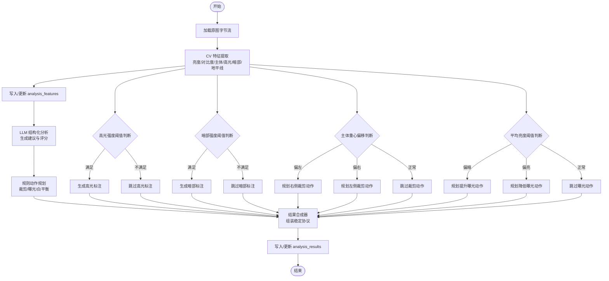
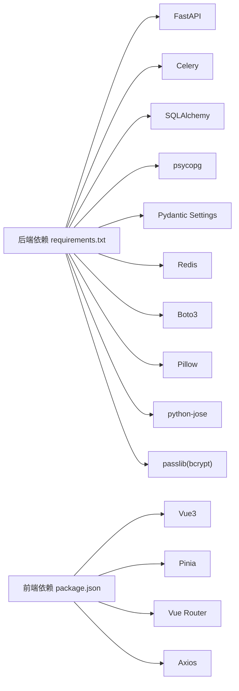

# 项目概述

<cite>
**本文引用的文件**
- [apps/api/requirements.txt](file://apps/api/requirements.txt)
- [apps/web/package.json](file://apps/web/package.json)
- [apps/api/app/main.py](file://apps/api/app/main.py)
- [apps/api/app/core/config.py](file://apps/api/app/core/config.py)
- [docs/architecture-v2.md](file://docs/architecture-v2.md)
- [packages/contracts/analysis-result.schema.json](file://packages/contracts/analysis-result.schema.json)
- [apps/api/app/models/base.py](file://apps/api/app/models/base.py)
- [apps/api/app/services/ai/analyzer.py](file://apps/api/app/services/ai/analyzer.py)
- [apps/api/app/tasks/analyze_photo.py](file://apps/api/app/tasks/analyze_photo.py)
- [apps/api/app/services/composer/result_composer.py](file://apps/api/app/services/composer/result_composer.py)
- [apps/api/app/services/cv/feature_extractor.py](file://apps/api/app/services/cv/feature_extractor.py)
- [apps/api/app/services/llm/analyzer.py](file://apps/api/app/services/llm/analyzer.py)
- [apps/api/app/services/rules/edit_planner.py](file://apps/api/app/services/rules/edit_planner.py)
- [apps/api/app/modules/analysis/router.py](file://apps/api/app/modules/analysis/router.py)
- [apps/web/src/App.vue](file://apps/web/src/App.vue)
- [infra/docker-compose.yml](file://infra/docker-compose.yml)
</cite>

## 目录
1. [引言](#引言)
2. [项目结构](#项目结构)
3. [核心组件](#核心组件)
4. [架构总览](#架构总览)
5. [详细组件分析](#详细组件分析)
6. [依赖关系分析](#依赖关系分析)
7. [性能考虑](#性能考虑)
8. [故障排查指南](#故障排查指南)
9. [结论](#结论)
10. [附录](#附录)

## 引言
AI摄影教练是一个面向摄影学习者与爱好者的一站式智能摄影分析与编辑辅助平台。其核心价值主张是通过“计算机视觉(CV)产出事实、大语言模型(LLM)产出解释、规则引擎产出可执行动作”的分层架构，将抽象的摄影建议转化为可预览、可应用的编辑操作，帮助用户在短时间内掌握构图、曝光、色彩等摄影要点，并持续提升拍摄水平。

项目的主要功能特性包括：
- 摄影图像上传与异步分析任务编排
- 基于CV的事实抽取（主体、地平线、高光/暗部区域、亮度/对比度统计）
- 基于LLM的结构化建议与评分体系
- 基于规则的自动编辑动作规划（裁剪、曝光、白平衡等）
- 历史任务查询与结果回看
- 用户认证与权限控制（逐步完善）

整体设计理念强调“前后端协议稳定化、中间层解耦、异步可扩展”。目标用户群体覆盖摄影初学者、爱好者以及希望系统化提升摄影技巧的进阶用户；应用场景包括日常修图前的智能建议、教学场景中的案例演示、以及个人摄影成长档案的沉淀。

## 项目结构
项目采用多仓多应用的组织方式，包含后端API、前端Web、Worker异步任务、基础设施编排与协议契约定义：

- apps/api：基于FastAPI的后端API服务，提供REST接口、任务编排、数据库访问与Celery异步任务调度
- apps/web：基于Vue3 + TypeScript的前端应用，提供上传、分析、历史、个人中心等页面
- apps/worker：Celery Worker容器，执行图像分析与编辑相关任务
- infra：Docker Compose编排，包含PostgreSQL、Redis、MinIO等基础设施
- packages/contracts：JSON Schema定义的前后端稳定协议，确保分析结果、标注与编辑动作的结构化与可演进性
- docs：架构文档，描述分层设计、数据模型与处理流程

图表来源
- [apps/api/app/main.py:1-36](file://apps/api/app/main.py#L1-L36)
- [apps/api/app/modules/analysis/router.py:1-151](file://apps/api/app/modules/analysis/router.py#L1-L151)
- [apps/api/app/tasks/analyze_photo.py:1-108](file://apps/api/app/tasks/analyze_photo.py#L1-L108)
- [infra/docker-compose.yml:1-107](file://infra/docker-compose.yml#L1-L107)

章节来源
- [apps/api/app/main.py:1-36](file://apps/api/app/main.py#L1-L36)
- [apps/web/src/App.vue:1-96](file://apps/web/src/App.vue#L1-L96)
- [infra/docker-compose.yml:1-107](file://infra/docker-compose.yml#L1-L107)

## 核心组件
- API入口与路由
  - FastAPI应用初始化、CORS中间件、路由注册与健康检查
  - 分析模块路由提供任务创建、详情查询、历史列表与重试
- 任务执行链
  - Celery Worker异步执行run_analysis_task，完成特征提取、LLM分析、规则动作规划与结果合成
- 服务层
  - CV特征提取：亮度、对比度、主体框、高光/暗部区域、地平线等
  - LLM分析：基于CV事实生成结构化建议与评分
  - 规则编辑规划：基于主体与曝光策略生成可执行动作
  - 结果合成器：统一输出稳定协议的分析结果
- 协议契约
  - analysis-result.schema.json定义了分析结果的稳定结构，确保前后端一致消费
- 前端应用
  - 提供上传、分析、历史、个人中心等页面，基于Vue Router与Pinia进行状态管理

章节来源
- [apps/api/app/main.py:1-36](file://apps/api/app/main.py#L1-L36)
- [apps/api/app/modules/analysis/router.py:1-151](file://apps/api/app/modules/analysis/router.py#L1-L151)
- [apps/api/app/tasks/analyze_photo.py:1-108](file://apps/api/app/tasks/analyze_photo.py#L1-L108)
- [apps/api/app/services/ai/analyzer.py:1-27](file://apps/api/app/services/ai/analyzer.py#L1-L27)
- [apps/api/app/services/composer/result_composer.py:1-99](file://apps/api/app/services/composer/result_composer.py#L1-L99)
- [apps/api/app/services/cv/feature_extractor.py:1-98](file://apps/api/app/services/cv/feature_extractor.py#L1-L98)
- [apps/api/app/services/llm/analyzer.py:1-139](file://apps/api/app/services/llm/analyzer.py#L1-L139)
- [apps/api/app/services/rules/edit_planner.py:1-97](file://apps/api/app/services/rules/edit_planner.py#L1-L97)
- [packages/contracts/analysis-result.schema.json:1-76](file://packages/contracts/analysis-result.schema.json#L1-L76)
- [apps/web/src/App.vue:1-96](file://apps/web/src/App.vue#L1-L96)

## 架构总览
项目采用“前端-后端-API层-Worker层-AI/CV服务层-存储/缓存/数据库”的分层设计，核心原则是“CV产出事实、LLM产出解释、规则引擎产出可执行动作”，并通过结果合成器统一输出稳定协议，确保前后端解耦与可演进。

图表来源
- [docs/architecture-v2.md:15-72](file://docs/architecture-v2.md#L15-L72)
- [apps/api/app/tasks/analyze_photo.py:1-108](file://apps/api/app/tasks/analyze_photo.py#L1-L108)
- [apps/api/app/services/composer/result_composer.py:1-99](file://apps/api/app/services/composer/result_composer.py#L1-L99)

章节来源
- [docs/architecture-v2.md:1-424](file://docs/architecture-v2.md#L1-L424)

## 详细组件分析

### 分析任务执行序列
从任务创建到结果返回的关键流程如下：

图表来源
- [apps/api/app/modules/analysis/router.py:45-90](file://apps/api/app/modules/analysis/router.py#L45-L90)
- [apps/api/app/tasks/analyze_photo.py:19-108](file://apps/api/app/tasks/analyze_photo.py#L19-L108)
- [apps/api/app/services/cv/feature_extractor.py:15-91](file://apps/api/app/services/cv/feature_extractor.py#L15-L91)
- [apps/api/app/services/llm/analyzer.py:8-118](file://apps/api/app/services/llm/analyzer.py#L8-L118)
- [apps/api/app/services/rules/edit_planner.py:6-34](file://apps/api/app/services/rules/edit_planner.py#L6-L34)
- [apps/api/app/services/composer/result_composer.py:8-23](file://apps/api/app/services/composer/result_composer.py#L8-L23)

章节来源
- [apps/api/app/modules/analysis/router.py:1-151](file://apps/api/app/modules/analysis/router.py#L1-L151)
- [apps/api/app/tasks/analyze_photo.py:1-108](file://apps/api/app/tasks/analyze_photo.py#L1-L108)

### 服务层类关系
服务层围绕CV、LLM、规则与合成器四个核心模块，形成清晰的职责边界与依赖关系：

图表来源
- [apps/api/app/services/ai/analyzer.py:10-26](file://apps/api/app/services/ai/analyzer.py#L10-L26)
- [apps/api/app/services/cv/feature_extractor.py:12-91](file://apps/api/app/services/cv/feature_extractor.py#L12-L91)
- [apps/api/app/services/llm/analyzer.py:5-132](file://apps/api/app/services/llm/analyzer.py#L5-L132)
- [apps/api/app/services/rules/edit_planner.py:5-90](file://apps/api/app/services/rules/edit_planner.py#L5-L90)
- [apps/api/app/services/composer/result_composer.py:5-92](file://apps/api/app/services/composer/result_composer.py#L5-L92)

章节来源
- [apps/api/app/services/ai/analyzer.py:1-27](file://apps/api/app/services/ai/analyzer.py#L1-L27)
- [apps/api/app/services/composer/result_composer.py:1-99](file://apps/api/app/services/composer/result_composer.py#L1-L99)
- [apps/api/app/services/cv/feature_extractor.py:1-98](file://apps/api/app/services/cv/feature_extractor.py#L1-L98)
- [apps/api/app/services/llm/analyzer.py:1-139](file://apps/api/app/services/llm/analyzer.py#L1-L139)
- [apps/api/app/services/rules/edit_planner.py:1-97](file://apps/api/app/services/rules/edit_planner.py#L1-L97)

### 数据模型与协议
- 数据库模型基类使用SQLAlchemy声明式基类，便于统一管理ORM模型
- 分析结果协议通过JSON Schema定义，确保前后端一致的结构与版本控制
- 协议涵盖摘要、建议、评分、标注与编辑动作等字段，支持建议与标注的双向关联

图表来源
- [apps/api/app/models/base.py:1-5](file://apps/api/app/models/base.py#L1-L5)
- [docs/architecture-v2.md:107-238](file://docs/architecture-v2.md#L107-L238)
- [packages/contracts/analysis-result.schema.json:14-72](file://packages/contracts/analysis-result.schema.json#L14-L72)

章节来源
- [apps/api/app/models/base.py:1-5](file://apps/api/app/models/base.py#L1-L5)
- [docs/architecture-v2.md:107-238](file://docs/architecture-v2.md#L107-L238)
- [packages/contracts/analysis-result.schema.json:1-76](file://packages/contracts/analysis-result.schema.json#L1-L76)

### 处理流程与决策逻辑
以下流程图展示了从图像到建议与动作的完整路径，以及关键的条件判断与输出：

图表来源
- [apps/api/app/tasks/analyze_photo.py:46-74](file://apps/api/app/tasks/analyze_photo.py#L46-L74)
- [apps/api/app/services/cv/feature_extractor.py:34-63](file://apps/api/app/services/cv/feature_extractor.py#L34-L63)
- [apps/api/app/services/llm/analyzer.py:32-111](file://apps/api/app/services/llm/analyzer.py#L32-L111)
- [apps/api/app/services/rules/edit_planner.py:36-90](file://apps/api/app/services/rules/edit_planner.py#L36-L90)
- [apps/api/app/services/composer/result_composer.py:25-92](file://apps/api/app/services/composer/result_composer.py#L25-L92)

章节来源
- [apps/api/app/tasks/analyze_photo.py:1-108](file://apps/api/app/tasks/analyze_photo.py#L1-L108)
- [apps/api/app/services/cv/feature_extractor.py:1-98](file://apps/api/app/services/cv/feature_extractor.py#L1-L98)
- [apps/api/app/services/llm/analyzer.py:1-139](file://apps/api/app/services/llm/analyzer.py#L1-L139)
- [apps/api/app/services/rules/edit_planner.py:1-97](file://apps/api/app/services/rules/edit_planner.py#L1-L97)
- [apps/api/app/services/composer/result_composer.py:1-99](file://apps/api/app/services/composer/result_composer.py#L1-L99)

## 依赖关系分析
- 技术栈选择
  - 后端：FastAPI提供高性能异步API，Celery+Redis实现异步任务队列，PostgreSQL持久化，Boto3集成S3兼容存储
  - 前端：Vue3 + TypeScript + Pinia + Vue Router，构建现代化单页应用
  - 基础设施：Docker Compose一键拉起数据库、缓存与对象存储
- 组件耦合与内聚
  - API层仅负责参数校验、任务创建与结果查询，不承载重型计算，内聚性良好
  - Worker层封装具体算法与外部服务调用，便于替换与扩展
  - 协议契约独立于代码实现，保证前后端解耦与版本演进
- 外部依赖与集成点
  - MinIO提供S3兼容的对象存储，用于图片原图与派生图的统一管理
  - Redis用于任务队列与可能的会话/缓存场景
  - PostgreSQL用于结构化数据持久化

图表来源
- [apps/api/requirements.txt:1-19](file://apps/api/requirements.txt#L1-L19)
- [apps/web/package.json:11-23](file://apps/web/package.json#L11-L23)

章节来源
- [apps/api/requirements.txt:1-19](file://apps/api/requirements.txt#L1-L19)
- [apps/web/package.json:1-26](file://apps/web/package.json#L1-L26)

## 性能考虑
- 异步化与解耦
  - 使用Celery异步执行耗时的图像分析任务，避免阻塞API响应
  - 将CV、LLM与规则动作分离，便于独立扩展与资源分配
- 存储与缓存
  - 对象存储统一管理原图与派生图，减少重复计算
  - Redis用于任务队列与可能的热点数据缓存
- 数据库与序列化
  - 使用结构化JSON字段存储分析特征与结果，配合Schema约束保证一致性
  - 通过版本字段支持协议演进与向后兼容
- 前端体验
  - 前端采用轻量状态管理与路由懒加载，提升首屏与切换性能

## 故障排查指南
- 常见问题定位
  - API无法连接数据库：检查数据库URL与容器健康状态
  - 任务无响应：确认Redis可用且Worker已启动
  - 图片上传失败：检查S3端点、密钥与桶权限
  - 分析结果为空：确认任务状态为SUCCEEDED，查看错误码与消息
- 关键日志与状态
  - API健康检查端点用于快速验证服务可用性
  - 任务模型包含状态、错误码与错误信息，便于定位失败原因
- 建议排查步骤
  1) 使用健康检查端点确认API可用
  2) 查看任务详情与错误信息
  3) 检查对象存储与数据库连通性
  4) 重试失败任务或创建新任务

章节来源
- [apps/api/app/main.py:32-35](file://apps/api/app/main.py#L32-L35)
- [apps/api/app/modules/analysis/router.py:128-151](file://apps/api/app/modules/analysis/router.py#L128-L151)
- [apps/api/app/tasks/analyze_photo.py:97-107](file://apps/api/app/tasks/analyze_photo.py#L97-L107)

## 结论
AI摄影教练项目通过清晰的分层架构与稳定协议，实现了从图像到建议再到可执行动作的闭环。其技术选型兼顾性能与可维护性，异步化与解耦设计为后续扩展（如风格识别、自动修图、成长系统）奠定了坚实基础。对于初学者，项目提供了从上传到结果的完整流程与直观界面；对于有经验的开发者，稳定的协议、模块化的服务与可演进的数据模型能够支撑持续迭代与规模化部署。

## 附录
- 开发与运行
  - 使用Docker Compose一键启动所有服务与依赖
  - 后端与前端分别提供开发脚本，便于本地调试
- 架构演进
  - 当前版本聚焦CV事实、LLM解释与规则动作的分离
  - 后续可按阶段迭代：引入评分、标注协议、自动裁剪与曝光动作，逐步完善自动修图能力

章节来源
- [infra/docker-compose.yml:1-107](file://infra/docker-compose.yml#L1-L107)
- [apps/web/package.json:6-10](file://apps/web/package.json#L6-L10)
- [docs/architecture-v2.md:384-424](file://docs/architecture-v2.md#L384-L424)