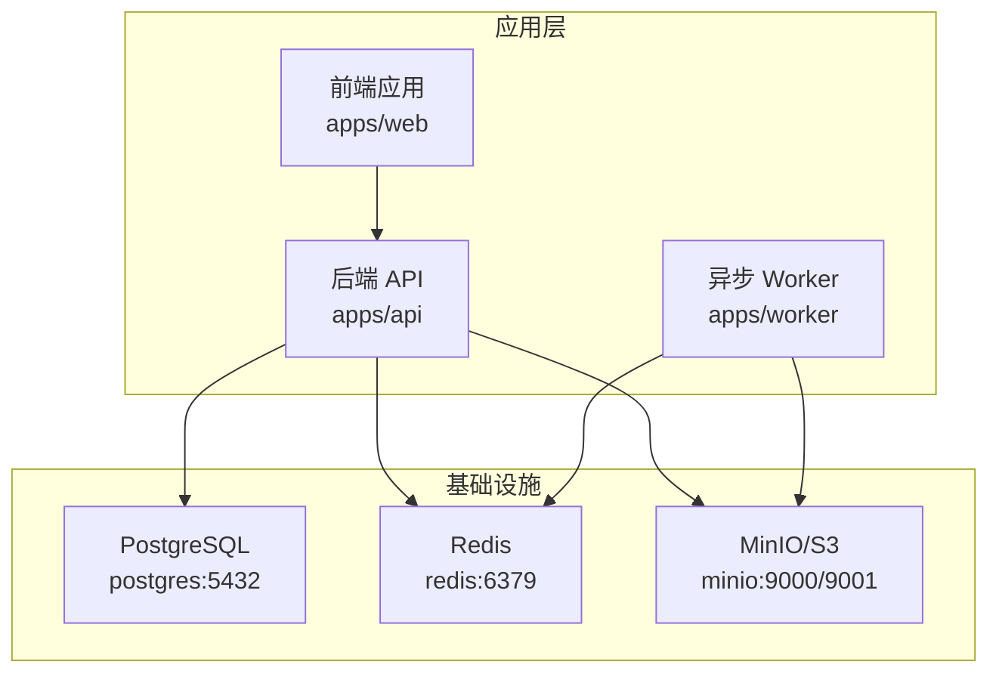
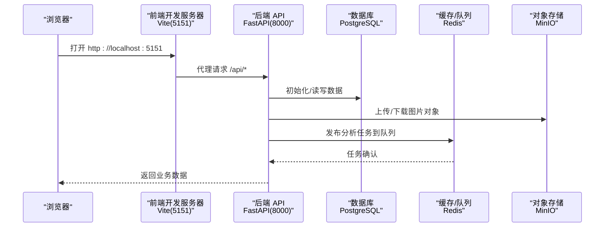
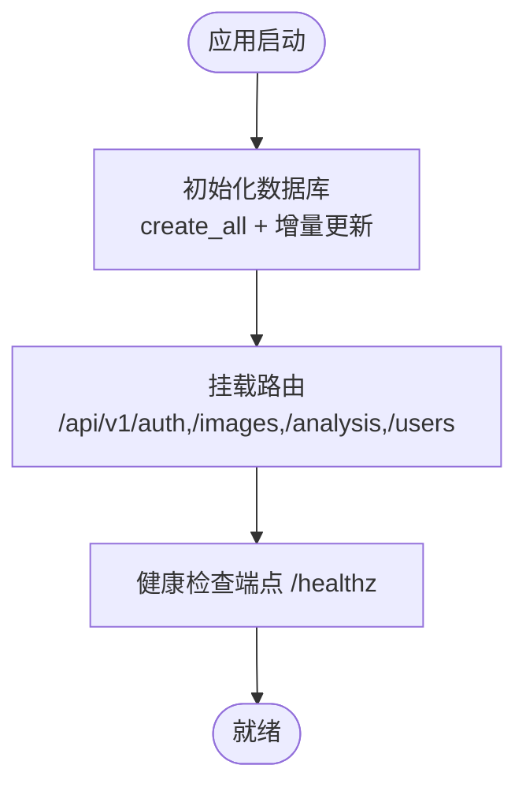
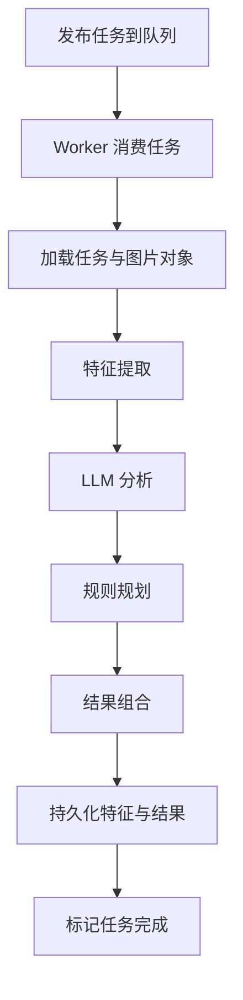
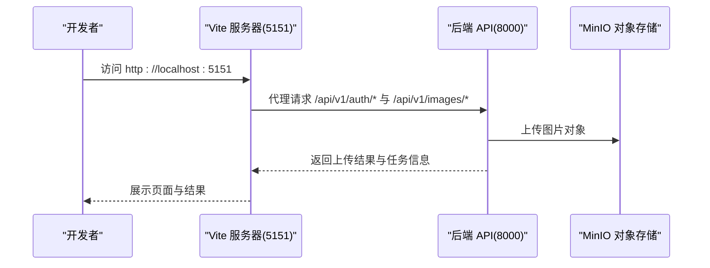
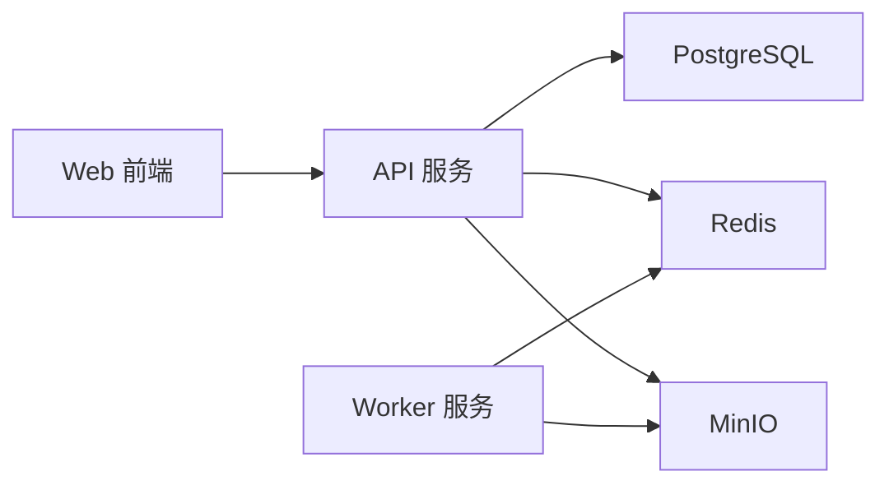
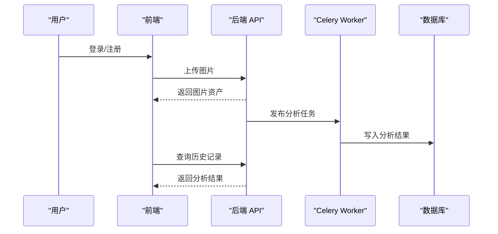

# 快速开始

<cite>
**本文引用的文件**
- [README.md](file://README.md)
- [docker-compose.yml](file://infra/docker-compose.yml)
- [Dockerfile（API）](file://apps/api/Dockerfile)
- [Dockerfile（Worker）](file://apps/worker/Dockerfile)
- [Dockerfile（Web）](file://apps/web/Dockerfile)
- [requirements.txt（API）](file://apps/api/requirements.txt)
- [package.json（Web）](file://apps/web/package.json)
- [main.py（API 应用入口）](file://apps/api/app/main.py)
- [config.py（API 配置）](file://apps/api/app/core/config.py)
- [database.py（数据库初始化）](file://apps/api/app/core/database.py)
- [celery_app.py（Celery 应用）](file://apps/api/app/core/celery_app.py)
- [analyze_photo.py（分析任务）](file://apps/api/app/tasks/analyze_photo.py)
- [router.py（认证模块）](file://apps/api/app/modules/auth/router.py)
- [router.py（图片模块）](file://apps/api/app/modules/images/router.py)
- [auth.ts（前端认证 API 封装）](file://apps/web/src/api/auth.ts)
- [images.ts（前端图片上传 API 封装）](file://apps/web/src/api/images.ts)
- [vite.config.ts（前端开发服务器配置）](file://apps/web/vite.config.ts)
</cite>

## 目录
1. [简介](#简介)
2. [项目结构](#项目结构)
3. [核心组件](#核心组件)
4. [架构总览](#架构总览)
5. [详细组件分析](#详细组件分析)
6. [依赖关系分析](#依赖关系分析)
7. [性能考虑](#性能考虑)
8. [故障排除指南](#故障排除指南)
9. [结论](#结论)
10. [附录](#附录)

## 简介
本指南面向首次接触 AI 摄影教练项目的开发者，帮助你在最短时间内完成环境搭建、项目启动与基础功能验证。你将学会：
- 安装 Python、Node.js、Docker 等必备工具
- 克隆项目、安装依赖、初始化数据库
- 使用 Docker Compose 启动后端 API、Worker、前端 Web 应用及基础设施（PostgreSQL、Redis、MinIO）
- 进行用户注册登录、图片上传与分析的基本操作
- 定位常见问题并进行故障排除

## 项目结构
项目采用多应用分层组织，核心目录与职责如下：
- apps/api：基于 FastAPI 的后端主服务，提供认证、图片上传、分析任务等接口
- apps/worker：基于 Celery 的异步分析 Worker，消费 Redis 队列执行图像分析
- apps/web：基于 Vue 3 + Vite 的前端 H5 应用，提供注册登录、历史记录、分析结果展示
- infra：Docker Compose 编排文件与 Nginx 配置，用于本地与生产部署
- packages/contracts：前后端共享的协议定义（JSON Schema）
- openspec：项目规范与变更管理目录

图表来源
- [docker-compose.yml:1-107](file://infra/docker-compose.yml#L1-L107)
- [Dockerfile（API）:1-23](file://apps/api/Dockerfile#L1-L23)
- [Dockerfile（Worker）:1-20](file://apps/worker/Dockerfile#L1-L20)
- [Dockerfile（Web）:1-22](file://apps/web/Dockerfile#L1-L22)

章节来源
- [README.md:34-52](file://README.md#L34-L52)

## 核心组件
- 后端 API（FastAPI）
  - 提供认证、图片上传、分析任务、用户信息等接口
  - 自动在启动时初始化数据库并应用增量表结构更新
- 异步 Worker（Celery）
  - 从 Redis 队列消费分析任务，调用 CV/LLM/Rules/Composer 服务链路完成分析
- 前端 Web（Vue 3 + Vite）
  - 开发端口 5151，通过代理转发到后端 API（默认 8000）
  - 提供注册、登录、个人资料、历史记录与图片上传界面
- 基础设施（Docker Compose）
  - PostgreSQL、Redis、MinIO 一键启动
  - API 与 Worker 服务通过环境变量连接上述服务

章节来源
- [main.py（API 应用入口）:1-36](file://apps/api/app/main.py#L1-L36)
- [database.py（数据库初始化）:21-51](file://apps/api/app/core/database.py#L21-L51)
- [celery_app.py（Celery 应用）:1-21](file://apps/api/app/core/celery_app.py#L1-L21)
- [docker-compose.yml:1-107](file://infra/docker-compose.yml#L1-L107)

## 架构总览
下图展示了本地开发环境的整体交互：前端通过代理访问后端 API；API 与 Worker 通过 Redis 协作；分析结果写入 PostgreSQL；图片对象存储于 MinIO。

图表来源
- [vite.config.ts（前端开发服务器配置）:1-26](file://apps/web/vite.config.ts#L1-L26)
- [docker-compose.yml:50-101](file://infra/docker-compose.yml#L50-L101)
- [main.py（API 应用入口）:1-36](file://apps/api/app/main.py#L1-L36)

## 详细组件分析

### 后端 API（FastAPI）
- 启动流程
  - 应用启动时自动初始化数据库并应用增量表结构更新
  - 注册认证、图片、分析、用户等路由
  - 提供健康检查端点
- 关键配置
  - 数据库连接、Redis 连接、S3/MinIO 配置、CORS 来源、JWT 密钥等
- 依赖清单
  - FastAPI、Uvicorn、SQLAlchemy、PostgreSQL 驱动、Celery、Redis、Boto3、Pillow、Pydantic Settings、Passlib、HTTPX 等

图表来源
- [main.py（API 应用入口）:27-35](file://apps/api/app/main.py#L27-L35)
- [database.py（数据库初始化）:21-51](file://apps/api/app/core/database.py#L21-L51)
- [config.py（API 配置）:13-38](file://apps/api/app/core/config.py#L13-L38)

章节来源
- [main.py（API 应用入口）:1-36](file://apps/api/app/main.py#L1-L36)
- [config.py（API 配置）:1-47](file://apps/api/app/core/config.py#L1-L47)
- [requirements.txt（API）:1-19](file://apps/api/requirements.txt#L1-L19)

### 异步 Worker（Celery）
- 角色与职责
  - 从 Redis 队列消费分析任务，执行图像特征提取、LLM 分析、规则规划与结果组合
  - 更新任务状态、错误码与完成时间
- 队列与路由
  - 任务路由到名为 analysis 的队列，便于横向扩展

图表来源
- [celery_app.py（Celery 应用）:12-19](file://apps/api/app/core/celery_app.py#L12-L19)
- [analyze_photo.py（分析任务）:19-108](file://apps/api/app/tasks/analyze_photo.py#L19-L108)

章节来源
- [celery_app.py（Celery 应用）:1-21](file://apps/api/app/core/celery_app.py#L1-L21)
- [analyze_photo.py（分析任务）:1-108](file://apps/api/app/tasks/analyze_photo.py#L1-L108)

### 前端 Web（Vue 3 + Vite）
- 开发体验
  - 默认端口 5151，通过代理将 /api 与 /healthz 请求转发至后端 API（默认 8000）
- 核心功能
  - 用户注册/登录、个人资料、历史记录查看、图片上传
- 依赖与构建
  - 使用 Vite 构建，Nginx 在生产镜像中提供静态资源服务

图表来源
- [vite.config.ts（前端开发服务器配置）:10-22](file://apps/web/vite.config.ts#L10-L22)
- [auth.ts（前端认证 API 封装）:29-35](file://apps/web/src/api/auth.ts#L29-L35)
- [images.ts（前端图片上传 API 封装）:12-20](file://apps/web/src/api/images.ts#L12-L20)

章节来源
- [package.json（Web）:1-26](file://apps/web/package.json#L1-L26)
- [vite.config.ts（前端开发服务器配置）:1-26](file://apps/web/vite.config.ts#L1-L26)
- [auth.ts（前端认证 API 封装）:1-56](file://apps/web/src/api/auth.ts#L1-L56)
- [images.ts（前端图片上传 API 封装）:1-22](file://apps/web/src/api/images.ts#L1-L22)

## 依赖关系分析
- 外部依赖
  - Python 3.12（API 与 Worker）
  - Node.js 22（前端构建与开发）
  - Docker 与 Docker Compose（本地与生产编排）
- 内部依赖
  - API 依赖 PostgreSQL、Redis、MinIO
  - Worker 依赖 Redis、MinIO
  - 前端通过代理依赖 API

图表来源
- [docker-compose.yml:50-101](file://infra/docker-compose.yml#L50-L101)
- [Dockerfile（API）:1-23](file://apps/api/Dockerfile#L1-L23)
- [Dockerfile（Worker）:1-20](file://apps/worker/Dockerfile#L1-L20)
- [Dockerfile（Web）:1-22](file://apps/web/Dockerfile#L1-L22)

章节来源
- [requirements.txt（API）:1-19](file://apps/api/requirements.txt#L1-L19)
- [package.json（Web）:1-26](file://apps/web/package.json#L1-L26)

## 性能考虑
- 数据库连接池与预检测
  - 启用 pool_pre_ping，提升连接稳定性
- 任务队列与并发
  - 通过队列名 analysis 实现任务隔离，便于水平扩展
- 存储与网络
  - 图片上传走对象存储，避免 API 服务直接承载大文件
- 前端开发体验
  - Vite 热更新与代理减少往返时间

章节来源
- [database.py（数据库初始化）:9-10](file://apps/api/app/core/database.py#L9-L10)
- [celery_app.py（Celery 应用）:16-19](file://apps/api/app/core/celery_app.py#L16-L19)
- [vite.config.ts（前端开发服务器配置）:10-22](file://apps/web/vite.config.ts#L10-L22)

## 故障排除指南
- Docker 拉取超时
  - 配置 Docker 镜像加速源，使用 docker info 验证
- docker compose 无法连接守护进程
  - 检查 docker.service、docker.socket 与 /run/docker.sock
- 页面可打开但 /healthz 返回 504
  - 查看 api、postgres、minio 日志定位失败服务
- 仅单个服务异常
  - 使用 docker compose logs <service> --tail 200 定位问题后再调整配置
- 前端代理不通
  - 确认 Vite 代理目标指向后端 API（默认 8000），并检查 CORS 配置

章节来源
- [README.md:209-215](file://README.md#L209-L215)
- [vite.config.ts（前端开发服务器配置）:10-22](file://apps/web/vite.config.ts#L10-L22)
- [config.py（API 配置）:25-38](file://apps/api/app/core/config.py#L25-L38)

## 结论
通过本指南，你可以快速完成本地开发环境搭建与基础功能验证。建议在掌握本地流程后，进一步阅读架构文档与核心模块源码，以深入理解系统的扩展性设计与服务链路。

## 附录

### 环境准备与安装
- Python 3.12
  - 用于本地开发或手动运行 API/Worker
- Node.js 22
  - 用于前端开发与构建
- Docker 与 Docker Compose
  - 本地一键启动所有服务

章节来源
- [Dockerfile（API）:1-2](file://apps/api/Dockerfile#L1-L2)
- [Dockerfile（Worker）:1-2](file://apps/worker/Dockerfile#L1-L2)
- [Dockerfile（Web）:1-1](file://apps/web/Dockerfile#L1-L1)
- [package.json（Web）:1-26](file://apps/web/package.json#L1-L26)

### 克隆与依赖安装
- 克隆仓库
- 安装后端依赖
  - 进入 apps/api，安装 requirements.txt 中的包
- 安装前端依赖
  - 进入 apps/web，安装 package.json 中的依赖

章节来源
- [requirements.txt（API）:1-19](file://apps/api/requirements.txt#L1-L19)
- [package.json（Web）:1-26](file://apps/web/package.json#L1-L26)

### 数据库初始化
- 使用 Docker Compose 启动后，API 会在启动事件中自动创建表并应用增量更新
- 若本地直连数据库，可参考数据库初始化逻辑手动执行

章节来源
- [database.py（数据库初始化）:21-51](file://apps/api/app/core/database.py#L21-L51)

### 本地开发环境启动
- 方式一：使用 Docker Compose（推荐）
  - 在仓库根目录执行 docker compose -f infra/docker-compose.yml up --build
  - 访问地址
    - 前端：http://localhost:5151
    - API 文档：http://localhost:8000/docs
    - 健康检查：http://localhost:8000/healthz
    - MinIO 控制台：http://localhost:9001
- 方式二：分别启动各组件
  - 启动 PostgreSQL、Redis、MinIO（可使用 docker compose）
  - 启动后端 API（监听 8000）
  - 启动 Celery Worker（监听 analysis 队列）
  - 启动前端 Vite（监听 5151）

章节来源
- [README.md:82-111](file://README.md#L82-L111)
- [docker-compose.yml:1-107](file://infra/docker-compose.yml#L1-L107)
- [main.py（API 应用入口）:32-35](file://apps/api/app/main.py#L32-L35)

### 基本使用示例
- 用户注册与登录
  - 前端调用注册/登录接口，获取访问与刷新令牌
- 图片上传与分析
  - 选择图片文件，调用上传接口，后端返回图片资产信息
  - Worker 从队列取出任务，执行分析并将结果写入数据库
- 历史记录查看
  - 前端拉取历史记录，展示分析结果

图表来源
- [router.py（认证模块）:24-46](file://apps/api/app/modules/auth/router.py#L24-L46)
- [router.py（图片模块）:20-77](file://apps/api/app/modules/images/router.py#L20-L77)
- [analyze_photo.py（分析任务）:19-108](file://apps/api/app/tasks/analyze_photo.py#L19-L108)

章节来源
- [auth.ts（前端认证 API 封装）:29-35](file://apps/web/src/api/auth.ts#L29-L35)
- [images.ts（前端图片上传 API 封装）:12-20](file://apps/web/src/api/images.ts#L12-L20)
- [router.py（认证模块）:1-93](file://apps/api/app/modules/auth/router.py#L1-L93)
- [router.py（图片模块）:1-77](file://apps/api/app/modules/images/router.py#L1-L77)