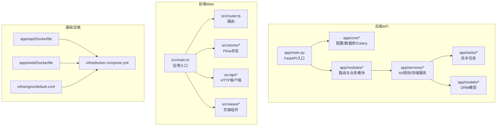
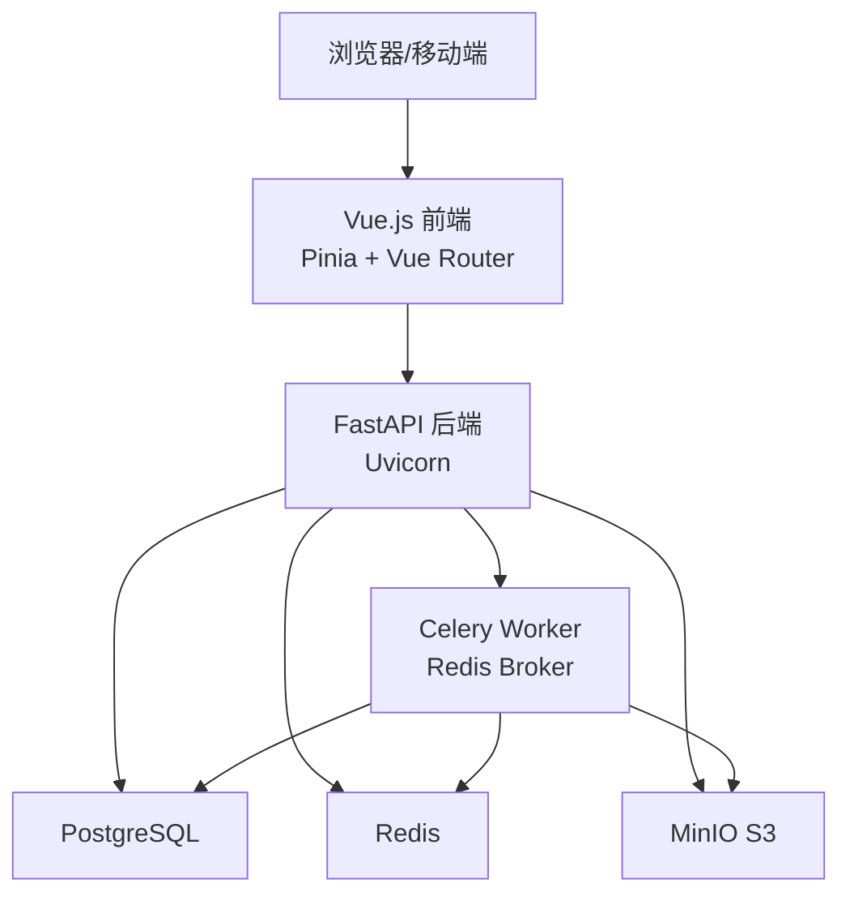
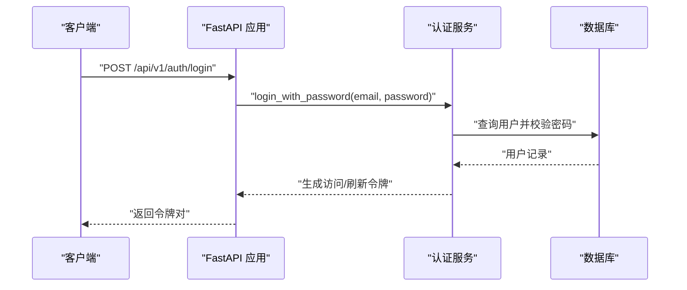
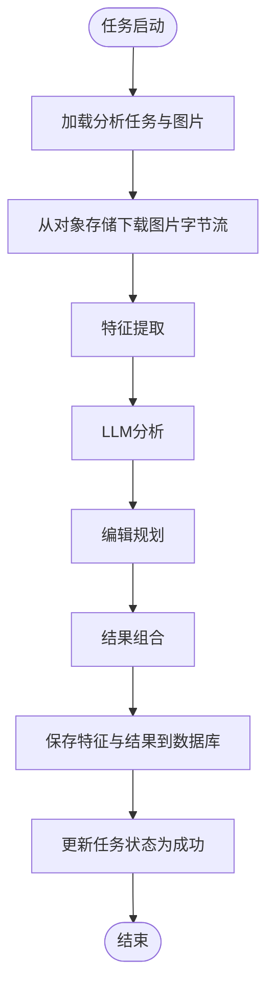
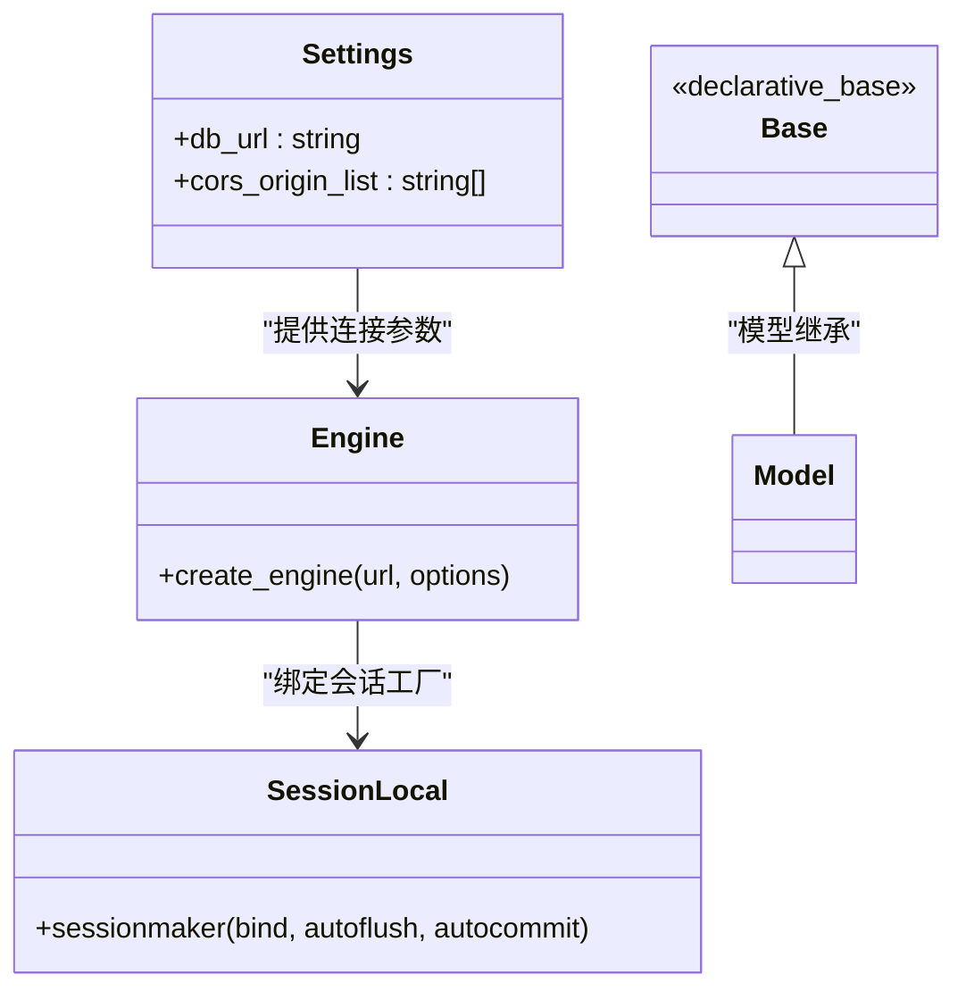
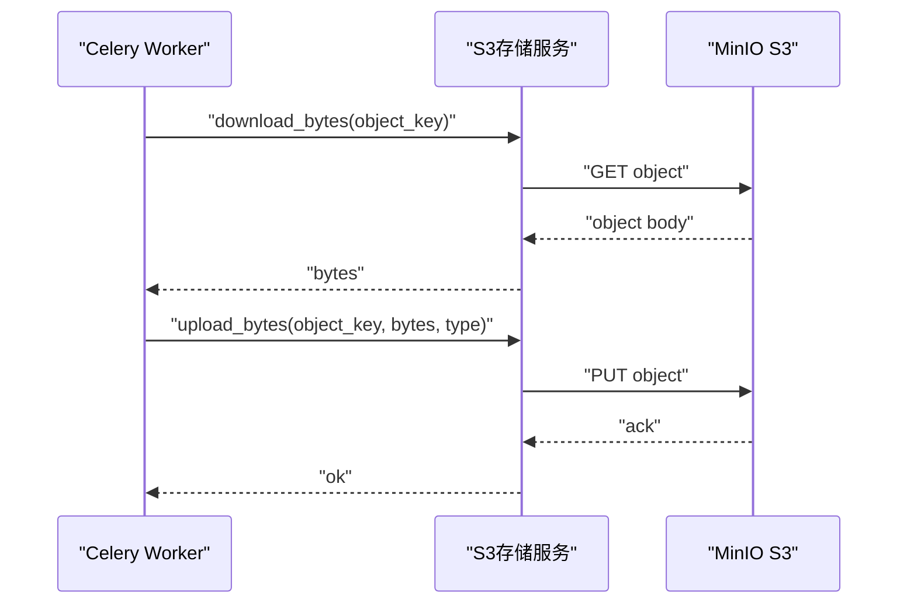
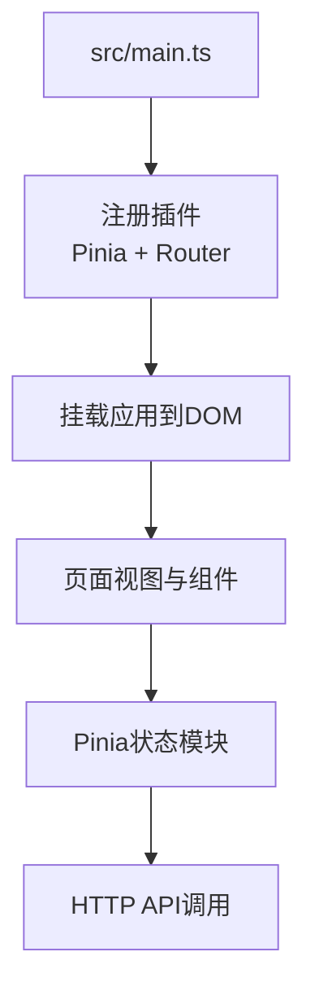
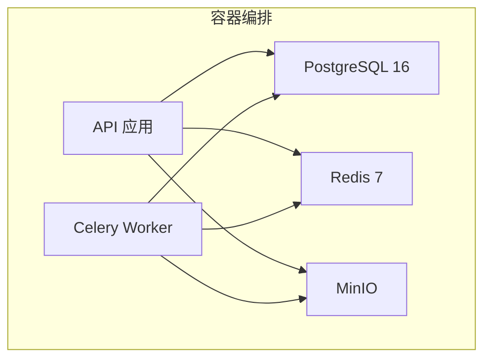
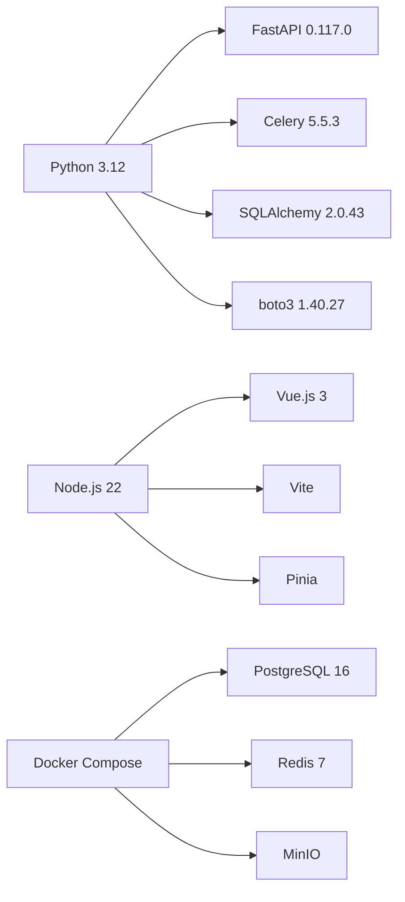

# 技术栈概览

<cite>
**本文档引用的文件**
- [apps/api/requirements.txt](file://apps/api/requirements.txt)
- [apps/web/package.json](file://apps/web/package.json)
- [apps/api/app/main.py](file://apps/api/app/main.py)
- [apps/api/app/core/config.py](file://apps/api/app/core/config.py)
- [apps/api/app/core/database.py](file://apps/api/app/core/database.py)
- [apps/api/app/core/celery_app.py](file://apps/api/app/core/celery_app.py)
- [apps/api/app/tasks/analyze_photo.py](file://apps/api/app/tasks/analyze_photo.py)
- [apps/api/app/modules/auth/service.py](file://apps/api/app/modules/auth/service.py)
- [apps/api/app/services/storage/s3_storage.py](file://apps/api/app/services/storage/s3_storage.py)
- [apps/api/app/models/base.py](file://apps/api/app/models/base.py)
- [apps/api/Dockerfile](file://apps/api/Dockerfile)
- [apps/web/Dockerfile](file://apps/web/Dockerfile)
- [apps/web/src/main.ts](file://apps/web/src/main.ts)
- [apps/web/vite.config.ts](file://apps/web/vite.config.ts)
- [infra/docker-compose.yml](file://infra/docker-compose.yml)
</cite>

## 目录
1. [简介](#简介)
2. [项目结构](#项目结构)
3. [核心组件](#核心组件)
4. [架构总览](#架构总览)
5. [详细组件分析](#详细组件分析)
6. [依赖关系分析](#依赖关系分析)
7. [性能考虑](#性能考虑)
8. [故障排除指南](#故障排除指南)
9. [结论](#结论)
10. [附录](#附录)

## 简介
本项目是一个AI摄影教练应用，采用前后端分离架构与容器化部署。后端基于FastAPI构建REST API，结合SQLAlchemy进行数据库访问，使用Celery与Redis实现异步任务处理，并通过PostgreSQL存储业务数据；前端使用Vue.js 3、TypeScript与Pinia实现交互式界面；基础设施通过Docker Compose编排，包含PostgreSQL、Redis、MinIO对象存储与Nginx反向代理。该技术栈旨在提供高性能、可扩展、易维护的现代化Web应用。

## 项目结构
项目采用模块化分层组织：
- 后端API：apps/api，包含核心应用、路由模块、服务层、模型定义与任务队列
- 前端Web：apps/web，包含Vue应用、状态管理、路由与构建配置
- 基础设施：infra，包含Docker Compose编排与Nginx配置
- 文档与规范：docs与openspec，用于架构设计与变更管理

**图表来源**
- [apps/api/app/main.py:1-36](file://apps/api/app/main.py#L1-L36)
- [apps/web/src/main.ts:1-14](file://apps/web/src/main.ts#L1-L14)
- [infra/docker-compose.yml:1-107](file://infra/docker-compose.yml#L1-L107)

**章节来源**
- [apps/api/app/main.py:1-36](file://apps/api/app/main.py#L1-L36)
- [apps/web/src/main.ts:1-14](file://apps/web/src/main.ts#L1-L14)
- [infra/docker-compose.yml:1-107](file://infra/docker-compose.yml#L1-L107)

## 核心组件
本节概述各技术组件及其在系统中的职责与协作方式。

- 后端框架与运行时
  - FastAPI：提供高性能异步API，集成Pydantic校验与OpenAPI文档自动生成
  - Uvicorn：ASGI服务器，承载FastAPI应用
  - Pydantic Settings：集中式配置管理，支持环境变量注入
- 数据持久化
  - SQLAlchemy 2.x：ORM与连接池，配合PostgreSQL进行数据建模与查询
  - 数据库初始化：启动时创建表结构并执行增量迁移
- 异步任务与消息队列
  - Celery：分布式任务队列，结合Redis作为Broker与结果后端
  - 任务路由：按队列区分分析任务，提升并发与隔离性
- 存储与对象管理
  - MinIO：S3兼容的对象存储，封装boto3进行上传下载
- 前端框架与状态管理
  - Vue.js 3 + TypeScript：响应式UI与类型安全
  - Pinia：轻量级状态管理，替代Vuex
  - Vue Router：单页应用路由
  - Vite：构建工具与开发服务器
- 容器化与编排
  - Docker：分别构建API与Web镜像
  - Docker Compose：编排PostgreSQL、Redis、MinIO与API/Worker服务
  - Nginx：静态资源服务与健康检查

**章节来源**
- [apps/api/requirements.txt:1-19](file://apps/api/requirements.txt#L1-L19)
- [apps/api/app/core/config.py:1-47](file://apps/api/app/core/config.py#L1-L47)
- [apps/api/app/core/database.py:1-51](file://apps/api/app/core/database.py#L1-L51)
- [apps/api/app/core/celery_app.py:1-21](file://apps/api/app/core/celery_app.py#L1-L21)
- [apps/api/app/tasks/analyze_photo.py:1-108](file://apps/api/app/tasks/analyze_photo.py#L1-L108)
- [apps/api/app/services/storage/s3_storage.py:1-59](file://apps/api/app/services/storage/s3_storage.py#L1-L59)
- [apps/web/package.json:1-26](file://apps/web/package.json#L1-L26)
- [apps/web/vite.config.ts:1-26](file://apps/web/vite.config.ts#L1-L26)
- [apps/api/Dockerfile:1-23](file://apps/api/Dockerfile#L1-L23)
- [apps/web/Dockerfile:1-22](file://apps/web/Dockerfile#L1-L22)
- [infra/docker-compose.yml:1-107](file://infra/docker-compose.yml#L1-L107)

## 架构总览
系统采用“前端-后端API-异步Worker-共享基础设施”的分层架构。前端通过HTTP与后端交互，后端负责认证、业务逻辑与数据持久化；耗时的图像分析由Celery Worker异步执行，结果写入数据库并通过API暴露。对象存储用于图片资产的读写，数据库与缓存支撑用户与任务状态管理。

**图表来源**
- [apps/api/app/main.py:1-36](file://apps/api/app/main.py#L1-L36)
- [apps/api/app/core/celery_app.py:1-21](file://apps/api/app/core/celery_app.py#L1-L21)
- [apps/api/app/core/database.py:1-51](file://apps/api/app/core/database.py#L1-L51)
- [apps/api/app/services/storage/s3_storage.py:1-59](file://apps/api/app/services/storage/s3_storage.py#L1-L59)
- [apps/web/src/main.ts:1-14](file://apps/web/src/main.ts#L1-L14)
- [infra/docker-compose.yml:1-107](file://infra/docker-compose.yml#L1-L107)

## 详细组件分析

### 后端API（FastAPI）
- 应用入口与中间件
  - 入口文件注册CORS、路由前缀与健康检查端点
  - 启动事件中初始化数据库
- 路由模块
  - 分析、认证、图片与用户模块各自独立路由，统一挂载至API前缀
- 安全与认证
  - 密码哈希与JWT令牌生成/校验，支持刷新与邮箱验证流程
- 数据库与模型
  - 使用SQLAlchemy ORM基类，启动时创建表并执行增量迁移

**图表来源**
- [apps/api/app/main.py:1-36](file://apps/api/app/main.py#L1-L36)
- [apps/api/app/modules/auth/service.py:1-145](file://apps/api/app/modules/auth/service.py#L1-L145)
- [apps/api/app/core/database.py:1-51](file://apps/api/app/core/database.py#L1-L51)

**章节来源**
- [apps/api/app/main.py:1-36](file://apps/api/app/main.py#L1-L36)
- [apps/api/app/modules/auth/service.py:1-145](file://apps/api/app/modules/auth/service.py#L1-L145)
- [apps/api/app/core/database.py:1-51](file://apps/api/app/core/database.py#L1-L51)

### 异步任务与Celery
- 任务定义
  - 图像分析任务从数据库加载任务与图片对象键，下载图片字节流
  - 依次调用特征提取、LLM分析、编辑规划与结果组合服务
  - 将特征与分析结果写回数据库，并更新任务状态
- 配置与路由
  - Redis作为Broker与结果后端
  - 任务路由将分析任务分配到专用队列，确保隔离与优先级

**图表来源**
- [apps/api/app/tasks/analyze_photo.py:1-108](file://apps/api/app/tasks/analyze_photo.py#L1-L108)
- [apps/api/app/core/celery_app.py:1-21](file://apps/api/app/core/celery_app.py#L1-L21)

**章节来源**
- [apps/api/app/tasks/analyze_photo.py:1-108](file://apps/api/app/tasks/analyze_photo.py#L1-L108)
- [apps/api/app/core/celery_app.py:1-21](file://apps/api/app/core/celery_app.py#L1-L21)

### 数据库与ORM（SQLAlchemy）
- 连接与会话
  - 使用配置中的数据库URL建立连接，启用pool_pre_ping保证连接有效性
  - 提供依赖注入的数据库会话生成器
- 初始化与迁移
  - 启动时创建所有表，并执行增量DDL更新（如新增列与索引）

**图表来源**
- [apps/api/app/core/config.py:1-47](file://apps/api/app/core/config.py#L1-L47)
- [apps/api/app/core/database.py:1-51](file://apps/api/app/core/database.py#L1-L51)
- [apps/api/app/models/base.py:1-5](file://apps/api/app/models/base.py#L1-L5)

**章节来源**
- [apps/api/app/core/database.py:1-51](file://apps/api/app/core/database.py#L1-L51)
- [apps/api/app/core/config.py:1-47](file://apps/api/app/core/config.py#L1-L47)
- [apps/api/app/models/base.py:1-5](file://apps/api/app/models/base.py#L1-L5)

### 对象存储（S3兼容）
- 服务封装
  - 使用boto3客户端，支持桶存在性检查与创建
  - 提供上传/下载字节流方法，异常统一转换为HTTP错误
- 缓存与可用性
  - 单例缓存实例，启动时确保桶存在

**图表来源**
- [apps/api/app/services/storage/s3_storage.py:1-59](file://apps/api/app/services/storage/s3_storage.py#L1-L59)

**章节来源**
- [apps/api/app/services/storage/s3_storage.py:1-59](file://apps/api/app/services/storage/s3_storage.py#L1-L59)

### 前端应用（Vue.js + TypeScript + Pinia）
- 应用入口
  - 创建Vue应用，注册Pinia与路由，挂载根组件
- 状态管理
  - 使用Pinia进行模块化状态管理，便于跨组件共享与测试
- 构建与开发
  - Vite提供开发服务器与代理，支持热更新与TypeScript类型检查
  - 生产构建输出静态资源，由Nginx提供服务

**图表来源**
- [apps/web/src/main.ts:1-14](file://apps/web/src/main.ts#L1-L14)
- [apps/web/vite.config.ts:1-26](file://apps/web/vite.config.ts#L1-L26)

**章节来源**
- [apps/web/src/main.ts:1-14](file://apps/web/src/main.ts#L1-L14)
- [apps/web/vite.config.ts:1-26](file://apps/web/vite.config.ts#L1-L26)
- [apps/web/package.json:1-26](file://apps/web/package.json#L1-L26)

### 容器化与编排
- 后端API镜像
  - 基于Python 3.12 Slim，安装依赖后以Uvicorn运行
- 前端镜像
  - 多阶段构建：Node构建产物，Nginx提供静态服务
- 编排服务
  - PostgreSQL、Redis、MinIO与API/Worker服务通过Compose编排
  - 环境变量集中注入，服务间健康检查保障可用性

**图表来源**
- [apps/api/Dockerfile:1-23](file://apps/api/Dockerfile#L1-L23)
- [apps/web/Dockerfile:1-22](file://apps/web/Dockerfile#L1-L22)
- [infra/docker-compose.yml:1-107](file://infra/docker-compose.yml#L1-L107)

**章节来源**
- [apps/api/Dockerfile:1-23](file://apps/api/Dockerfile#L1-L23)
- [apps/web/Dockerfile:1-22](file://apps/web/Dockerfile#L1-L22)
- [infra/docker-compose.yml:1-107](file://infra/docker-compose.yml#L1-L107)

## 依赖关系分析
- 版本与兼容性
  - Python 3.12（API与Worker镜像）
  - Node.js 22（前端构建与运行）
  - PostgreSQL 16（生产镜像可定制）
  - Redis 7（生产镜像可定制）
  - FastAPI 0.117.0、SQLAlchemy 2.0.43、Celery 5.5.3、Redis 6.4.0、boto3 1.40.27、Pillow 11.3.0
- 组件耦合
  - API与Worker通过Redis解耦，任务通过对象存储传递二进制数据
  - 前端通过API网关访问后端，CORS策略允许指定源
- 外部依赖
  - MinIO提供S3兼容对象存储
  - Nginx提供静态资源与健康检查

**图表来源**
- [apps/api/requirements.txt:1-19](file://apps/api/requirements.txt#L1-L19)
- [apps/web/package.json:1-26](file://apps/web/package.json#L1-L26)
- [infra/docker-compose.yml:1-107](file://infra/docker-compose.yml#L1-L107)

**章节来源**
- [apps/api/requirements.txt:1-19](file://apps/api/requirements.txt#L1-L19)
- [apps/web/package.json:1-26](file://apps/web/package.json#L1-L26)
- [infra/docker-compose.yml:1-107](file://infra/docker-compose.yml#L1-L107)

## 性能考虑
- 异步任务
  - 使用Celery队列隔离长耗时任务，避免阻塞主API线程
  - 任务路由按队列调度，提升吞吐与稳定性
- 数据库
  - 连接池与pre_ping减少连接失效导致的失败
  - 增量DDL更新避免全量迁移带来的停机
- 对象存储
  - S3客户端超时与重试配置平衡可靠性与延迟
- 前端
  - Vite开发服务器与按需代理，降低本地调试成本
  - 生产构建优化静态资源，Nginx提供高效静态服务

## 故障排除指南
- 健康检查
  - API与Nginx均提供健康检查端点，便于编排器监控
- 常见问题定位
  - 数据库连接失败：检查PostgreSQL服务状态与连接URL
  - 任务无响应：确认Redis服务健康与队列名称正确
  - 对象存储不可用：验证MinIO服务与桶权限
  - 前端无法访问后端：检查CORS配置与代理设置
- 日志与调试
  - 认证服务在开发模式下输出密码重置令牌日志，便于调试
  - 任务异常会回滚并记录错误码与消息

**章节来源**
- [apps/api/app/main.py:32-34](file://apps/api/app/main.py#L32-L34)
- [apps/web/vite.config.ts:10-23](file://apps/web/vite.config.ts#L10-L23)
- [apps/api/app/modules/auth/service.py:116-123](file://apps/api/app/modules/auth/service.py#L116-L123)
- [apps/api/app/tasks/analyze_photo.py:97-107](file://apps/api/app/tasks/analyze_photo.py#L97-L107)
- [apps/api/app/services/storage/s3_storage.py:23-32](file://apps/api/app/services/storage/s3_storage.py#L23-L32)

## 结论
本技术栈通过现代框架与容器化编排实现了高内聚、低耦合的系统架构。后端以FastAPI为核心，结合SQLAlchemy与Celery构建高性能与可扩展的服务层；前端以Vue.js与Pinia提供良好的用户体验；基础设施通过Docker Compose实现一键部署与运维。该方案适合需要快速迭代与稳定运行的AI应用。

## 附录
- 学习路径建议
  - 后端：先掌握FastAPI基础与路由，再学习SQLAlchemy ORM与数据库迁移，最后理解Celery任务与Redis使用
  - 前端：从Vue.js与TypeScript入门，学习Pinia状态管理与Vue Router路由，再掌握Vite与构建优化
  - 基础设施：了解Docker镜像构建与Compose编排，掌握PostgreSQL、Redis与S3的基本使用
- 版本与兼容性要点
  - Python 3.12与Node.js 22为当前镜像基础
  - PostgreSQL 16与Redis 7为默认生产镜像版本
  - 所有依赖版本详见后端与前端的包管理文件