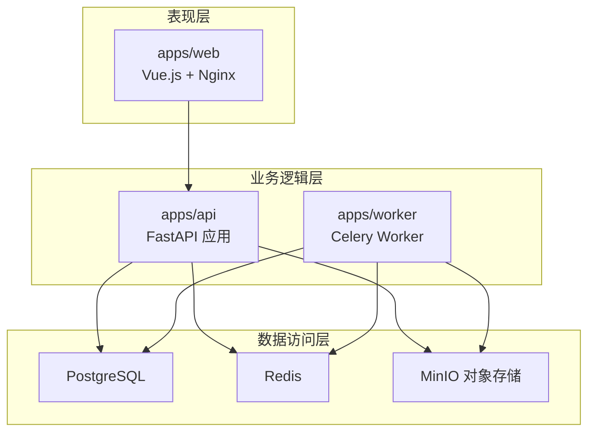
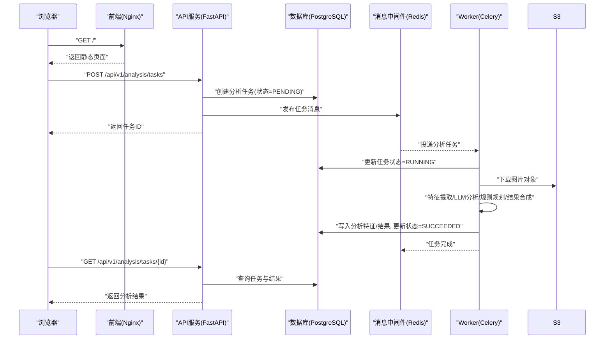
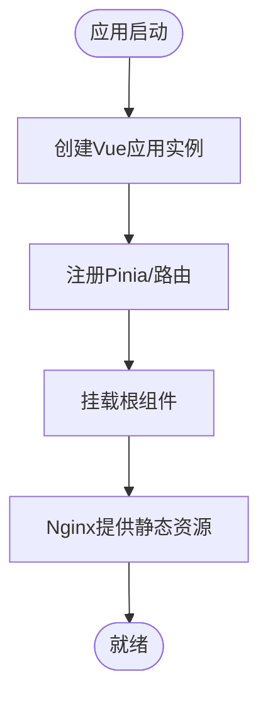
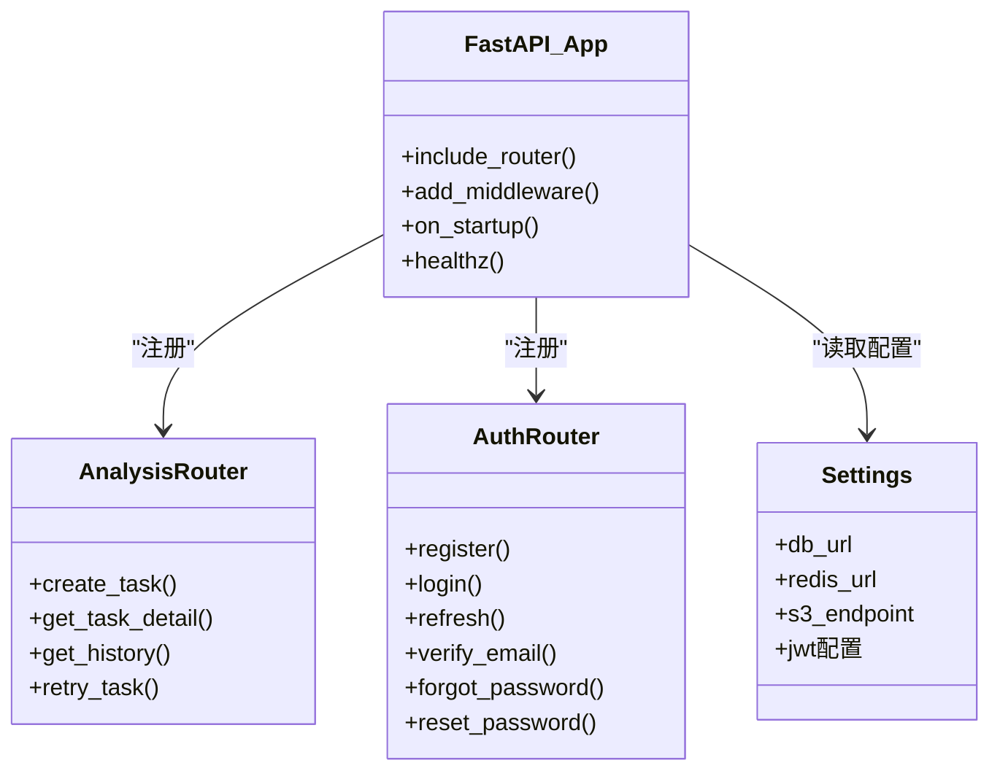
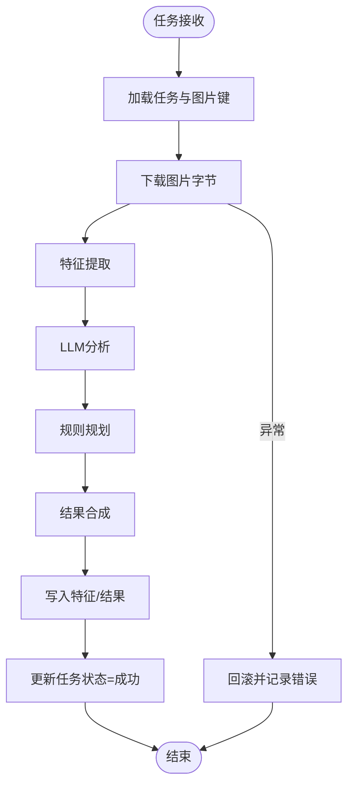
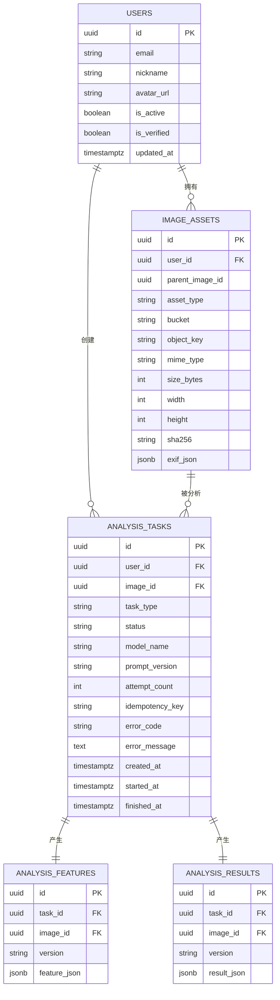
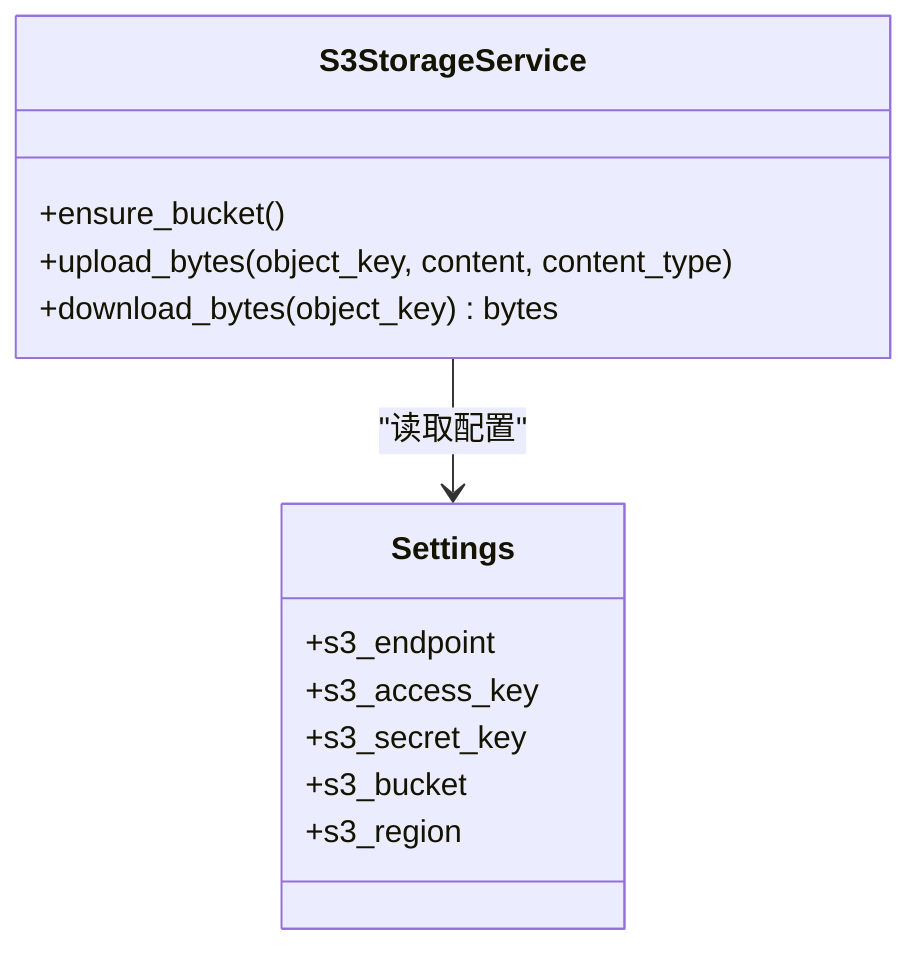
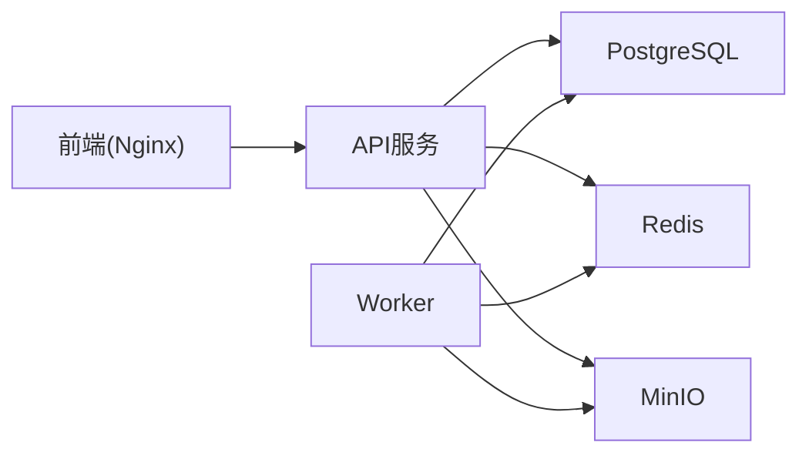
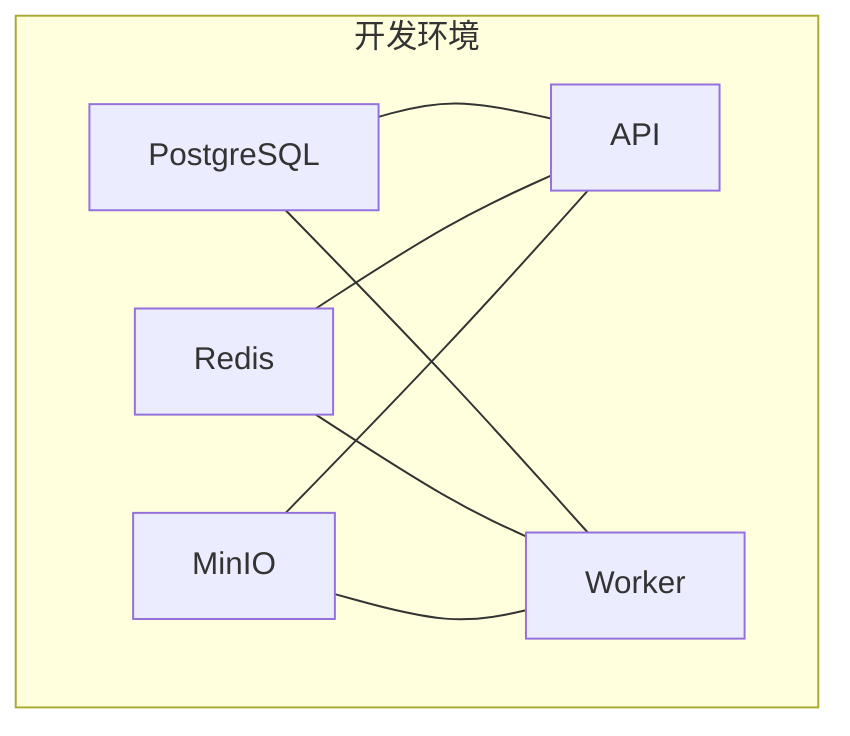

# 架构设计

<cite>
**本文引用的文件**
- [apps/api/app/main.py](file://apps/api/app/main.py)
- [apps/api/app/core/celery_app.py](file://apps/api/app/core/celery_app.py)
- [apps/api/app/core/config.py](file://apps/api/app/core/config.py)
- [apps/api/app/core/database.py](file://apps/api/app/core/database.py)
- [apps/api/app/modules/analysis/router.py](file://apps/api/app/modules/analysis/router.py)
- [apps/api/app/modules/auth/router.py](file://apps/api/app/modules/auth/router.py)
- [apps/api/app/models/analysis_task.py](file://apps/api/app/models/analysis_task.py)
- [apps/api/app/tasks/analyze_photo.py](file://apps/api/app/tasks/analyze_photo.py)
- [apps/api/app/services/storage/s3_storage.py](file://apps/api/app/services/storage/s3_storage.py)
- [apps/api/Dockerfile](file://apps/api/Dockerfile)
- [apps/web/src/main.ts](file://apps/web/src/main.ts)
- [apps/web/Dockerfile](file://apps/web/Dockerfile)
- [infra/docker-compose.yml](file://infra/docker-compose.yml)
- [docs/architecture-v2.md](file://docs/architecture-v2.md)
</cite>

## 目录
1. [引言](#引言)
2. [项目结构](#项目结构)
3. [核心组件](#核心组件)
4. [架构总览](#架构总览)
5. [详细组件分析](#详细组件分析)
6. [依赖分析](#依赖分析)
7. [性能考虑](#性能考虑)
8. [故障排查指南](#故障排查指南)
9. [结论](#结论)
10. [附录](#附录)

## 引言
本架构设计文档面向“AI摄影教练”项目，系统性阐述三层架构与微服务化演进路径：表现层（Vue.js前端）、业务逻辑层（FastAPI后端）、数据访问层（数据库与对象存储），以及围绕异步任务处理的Worker服务职责划分。文档结合现有代码实现与架构文档，给出组件交互、数据流向、技术决策与权衡，并提供架构图与部署拓扑图，帮助读者快速理解系统现状与扩展方向。

## 项目结构
项目采用多仓（monorepo）组织方式，按功能域拆分为三个主要应用与基础设施：
- apps/web：Vue.js前端应用，构建后由Nginx提供静态资源服务
- apps/api：FastAPI后端API服务，提供认证、图像管理、分析任务等接口
- apps/worker：Celery Worker服务，承载异步分析任务
- infra：Docker Compose编排与Nginx配置
- docs：架构设计文档
- packages/contracts：前后端协议Schema定义

**图表来源**
- [apps/web/Dockerfile:1-22](file://apps/web/Dockerfile#L1-L22)
- [apps/api/Dockerfile:1-23](file://apps/api/Dockerfile#L1-L23)
- [infra/docker-compose.yml:1-107](file://infra/docker-compose.yml#L1-L107)

**章节来源**
- [apps/web/src/main.ts:1-14](file://apps/web/src/main.ts#L1-L14)
- [apps/api/app/main.py:1-36](file://apps/api/app/main.py#L1-L36)
- [apps/api/app/core/config.py:1-47](file://apps/api/app/core/config.py#L1-L47)
- [apps/api/app/core/database.py:1-51](file://apps/api/app/core/database.py#L1-L51)
- [apps/api/app/core/celery_app.py:1-21](file://apps/api/app/core/celery_app.py#L1-L21)
- [infra/docker-compose.yml:1-107](file://infra/docker-compose.yml#L1-L107)

## 核心组件
- 前端应用（apps/web）
  - 使用Vue 3 + Pinia + 路由，入口初始化应用实例并挂载根组件
  - 构建产物通过Nginx对外提供静态服务
- API服务（apps/api）
  - FastAPI应用，启用CORS，注册各模块路由，启动时初始化数据库
  - 提供认证、图像、分析等接口；分析任务通过Celery异步执行
- Worker服务（apps/worker）
  - 基于Celery的异步任务执行器，消费队列并执行分析流水线
- 数据与存储
  - PostgreSQL：持久化用户、图像资产、分析任务、结果等
  - Redis：Celery消息代理与结果后端
  - MinIO：兼容S3的对象存储，存放图片与派生内容
- 配置与环境
  - 通过Settings集中管理数据库、Redis、S3、JWT等配置项

**章节来源**
- [apps/web/src/main.ts:1-14](file://apps/web/src/main.ts#L1-L14)
- [apps/api/app/main.py:1-36](file://apps/api/app/main.py#L1-L36)
- [apps/api/app/core/config.py:1-47](file://apps/api/app/core/config.py#L1-L47)
- [apps/api/app/core/database.py:1-51](file://apps/api/app/core/database.py#L1-L51)
- [apps/api/app/core/celery_app.py:1-21](file://apps/api/app/core/celery_app.py#L1-L21)
- [apps/api/app/services/storage/s3_storage.py:1-59](file://apps/api/app/services/storage/s3_storage.py#L1-L59)
- [infra/docker-compose.yml:1-107](file://infra/docker-compose.yml#L1-L107)

## 架构总览
系统采用“前端静态化 + 后端API + 异步Worker”的微服务化思路：
- 前端通过HTTP与后端交互，无需直连数据库或存储
- API服务负责请求接入、参数校验、任务创建与状态查询
- Worker服务负责重型计算（特征提取、LLM分析、规则规划、结果合成）
- 数据一致性通过数据库事务与幂等键保障；错误通过任务状态与异常回滚记录

**图表来源**
- [apps/api/app/modules/analysis/router.py:45-74](file://apps/api/app/modules/analysis/router.py#L45-L74)
- [apps/api/app/tasks/analyze_photo.py:19-108](file://apps/api/app/tasks/analyze_photo.py#L19-L108)
- [apps/api/app/services/storage/s3_storage.py:45-50](file://apps/api/app/services/storage/s3_storage.py#L45-L50)
- [apps/api/app/core/celery_app.py:5-19](file://apps/api/app/core/celery_app.py#L5-L19)
- [apps/api/app/core/database.py:21-25](file://apps/api/app/core/database.py#L21-L25)

## 详细组件分析

### 前端应用（Vue.js）
- 初始化流程
  - 创建Vue应用实例，注册Pinia与路由，挂载根组件
- 静态资源
  - 构建产物交由Nginx托管，容器内暴露80端口并配置健康检查
- 与后端交互
  - 通过Vite构建时注入的API基础URL访问后端接口

**图表来源**
- [apps/web/src/main.ts:1-14](file://apps/web/src/main.ts#L1-L14)
- [apps/web/Dockerfile:1-22](file://apps/web/Dockerfile#L1-L22)

**章节来源**
- [apps/web/src/main.ts:1-14](file://apps/web/src/main.ts#L1-L14)
- [apps/web/Dockerfile:1-22](file://apps/web/Dockerfile#L1-L22)

### API服务（FastAPI）
- 应用初始化
  - 注册CORS策略，设置API前缀，注册各模块路由
  - 启动事件中初始化数据库与增量Schema更新
- 认证模块
  - 提供注册、登录、刷新、邮箱验证、忘记/重置密码等端点
- 分析模块
  - 创建分析任务（写入任务记录并发布异步任务）
  - 查询任务详情与历史，支持重试
- 数据与安全
  - 使用SQLAlchemy ORM连接PostgreSQL
  - JWT相关配置集中于Settings

**图表来源**
- [apps/api/app/main.py:1-36](file://apps/api/app/main.py#L1-L36)
- [apps/api/app/modules/analysis/router.py:24-151](file://apps/api/app/modules/analysis/router.py#L24-L151)
- [apps/api/app/modules/auth/router.py:21-93](file://apps/api/app/modules/auth/router.py#L21-L93)
- [apps/api/app/core/config.py:6-47](file://apps/api/app/core/config.py#L6-L47)

**章节来源**
- [apps/api/app/main.py:1-36](file://apps/api/app/main.py#L1-L36)
- [apps/api/app/modules/analysis/router.py:45-151](file://apps/api/app/modules/analysis/router.py#L45-L151)
- [apps/api/app/modules/auth/router.py:24-93](file://apps/api/app/modules/auth/router.py#L24-L93)
- [apps/api/app/core/config.py:1-47](file://apps/api/app/core/config.py#L1-L47)
- [apps/api/app/core/database.py:21-51](file://apps/api/app/core/database.py#L21-L51)

### Worker服务（Celery）
- 任务定义
  - 任务名称与路由配置，指定队列为analysis
- 执行流程
  - 从数据库加载任务与图片对象键，下载图片字节
  - 调用CV特征提取、LLM分析、规则规划、结果合成服务
  - 写入分析特征与结果，更新任务状态与时间戳
  - 异常时回滚并记录错误码与消息

**图表来源**
- [apps/api/app/tasks/analyze_photo.py:19-108](file://apps/api/app/tasks/analyze_photo.py#L19-L108)
- [apps/api/app/core/celery_app.py:5-19](file://apps/api/app/core/celery_app.py#L5-L19)

**章节来源**
- [apps/api/app/core/celery_app.py:1-21](file://apps/api/app/core/celery_app.py#L1-L21)
- [apps/api/app/tasks/analyze_photo.py:19-108](file://apps/api/app/tasks/analyze_photo.py#L19-L108)

### 数据模型与关系
- 关键实体
  - 用户、图像资产、分析任务、分析特征、分析结果
- 关系与索引
  - 任务与用户、图像存在外键关系
  - 为任务表建立常用查询索引以优化历史查询

**图表来源**
- [apps/api/app/models/analysis_task.py:10-36](file://apps/api/app/models/analysis_task.py#L10-L36)
- [apps/api/app/core/database.py:28-51](file://apps/api/app/core/database.py#L28-L51)
- [docs/architecture-v2.md:107-238](file://docs/architecture-v2.md#L107-L238)

**章节来源**
- [apps/api/app/models/analysis_task.py:1-36](file://apps/api/app/models/analysis_task.py#L1-L36)
- [apps/api/app/core/database.py:28-51](file://apps/api/app/core/database.py#L28-L51)
- [docs/architecture-v2.md:107-238](file://docs/architecture-v2.md#L107-L238)

### 存储服务（S3兼容）
- 功能
  - 确保桶存在，上传/下载字节流
  - 统一封装异常为HTTP 503
- 配置
  - 通过Settings注入端点、凭证、桶名、区域

**图表来源**
- [apps/api/app/services/storage/s3_storage.py:11-59](file://apps/api/app/services/storage/s3_storage.py#L11-L59)
- [apps/api/app/core/config.py:16-20](file://apps/api/app/core/config.py#L16-L20)

**章节来源**
- [apps/api/app/services/storage/s3_storage.py:1-59](file://apps/api/app/services/storage/s3_storage.py#L1-L59)
- [apps/api/app/core/config.py:16-20](file://apps/api/app/core/config.py#L16-L20)

## 依赖分析
- 组件耦合
  - API服务对数据库、Redis、S3存在直接依赖
  - Worker服务与API服务共享模型与服务接口
- 外部依赖
  - PostgreSQL、Redis、MinIO通过Compose统一编排
- 配置集中化
  - Settings集中管理所有外部服务地址与密钥，便于切换与测试

**图表来源**
- [apps/api/app/core/config.py:13-20](file://apps/api/app/core/config.py#L13-L20)
- [infra/docker-compose.yml:50-101](file://infra/docker-compose.yml#L50-L101)

**章节来源**
- [apps/api/app/core/config.py:13-20](file://apps/api/app/core/config.py#L13-L20)
- [infra/docker-compose.yml:1-107](file://infra/docker-compose.yml#L1-L107)

## 性能考虑
- 异步任务处理
  - 将重型计算移至Worker，避免阻塞API响应，提升吞吐与稳定性
- 数据库优化
  - 为分析任务表建立复合索引，加速历史查询与状态筛选
- 缓存与连接池
  - SQLAlchemy连接池与Redis缓存可减少连接开销
- 存储I/O
  - S3上传/下载超时配置与重试策略降低网络抖动影响
- 前端静态化
  - Nginx提供静态资源，减少后端压力

[本节为通用性能指导，不直接分析具体文件]

## 故障排查指南
- 健康检查
  - API服务提供健康端点，前端容器内置健康检查命令
- 错误处理
  - 存储服务在异常时返回HTTP 503，便于快速定位存储问题
  - Worker在任务失败时记录错误码与消息，便于追踪
- 数据库初始化
  - 启动时自动创建表与增量更新，确保Schema一致性

**章节来源**
- [apps/api/app/main.py:32-34](file://apps/api/app/main.py#L32-L34)
- [apps/web/Dockerfile:21-22](file://apps/web/Dockerfile#L21-L22)
- [apps/api/app/services/storage/s3_storage.py:23-32](file://apps/api/app/services/storage/s3_storage.py#L23-L32)
- [apps/api/app/tasks/analyze_photo.py:97-107](file://apps/api/app/tasks/analyze_photo.py#L97-L107)
- [apps/api/app/core/database.py:21-51](file://apps/api/app/core/database.py#L21-L51)

## 结论
本项目已具备清晰的三层架构与异步微服务雏形：前端静态化、API服务负责编排、Worker承载计算。通过引入明确的协议Schema、增强任务类型与幂等控制、分离CV/LLM/规则服务，系统可在不破坏现有MVP接口的前提下平滑演进，逐步实现标注协议稳定化与可执行编辑动作闭环。

[本节为总结性内容，不直接分析具体文件]

## 附录
- 部署拓扑
  - 开发环境通过Compose一键拉起PostgreSQL、Redis、MinIO、API、Worker
  - 生产环境建议引入负载均衡、容器编排平台与监控告警体系

**图表来源**
- [infra/docker-compose.yml:1-107](file://infra/docker-compose.yml#L1-L107)

**章节来源**
- [infra/docker-compose.yml:1-107](file://infra/docker-compose.yml#L1-L107)
- [apps/api/Dockerfile:1-23](file://apps/api/Dockerfile#L1-L23)
- [apps/web/Dockerfile:1-22](file://apps/web/Dockerfile#L1-L22)