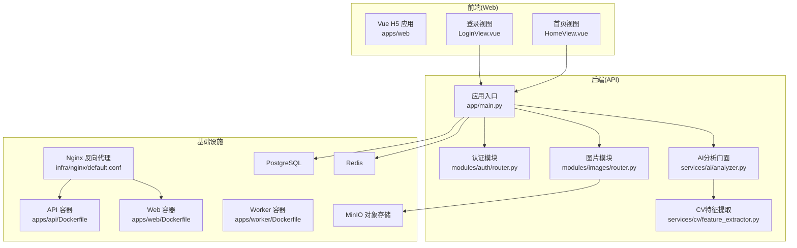
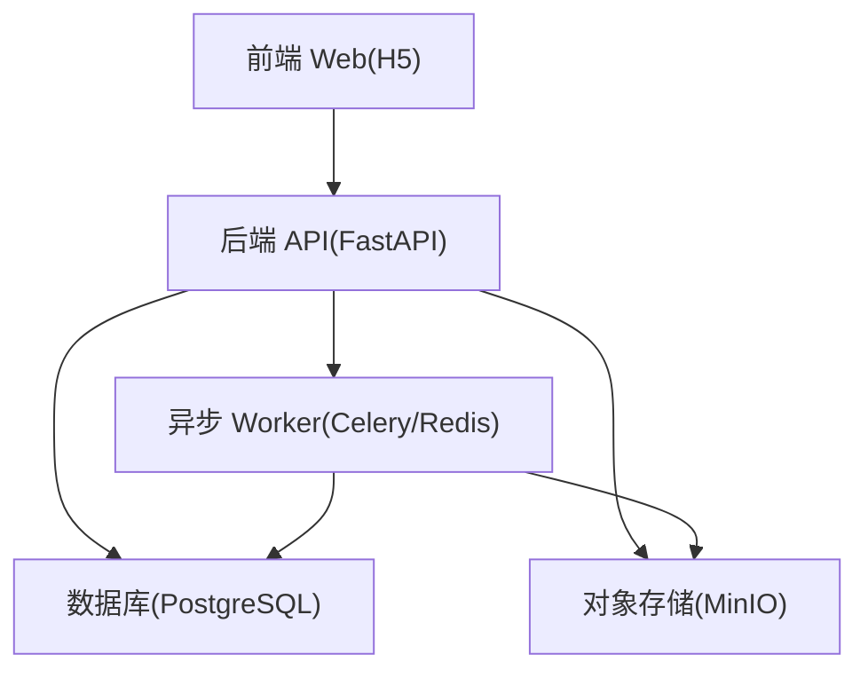
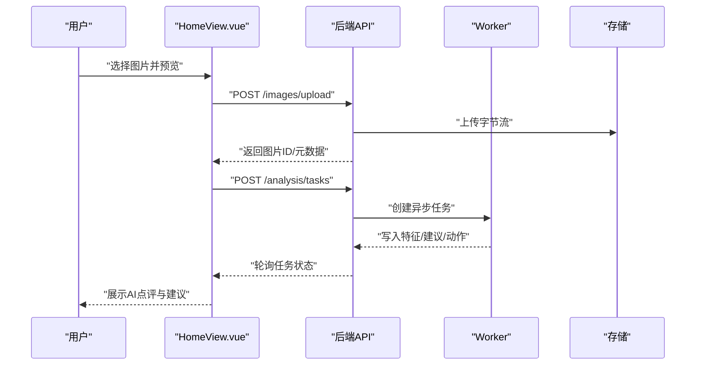
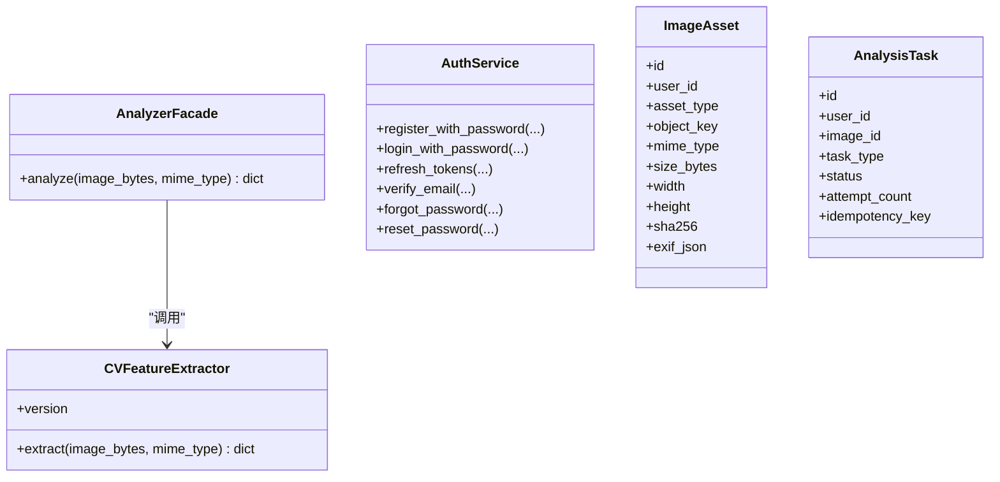
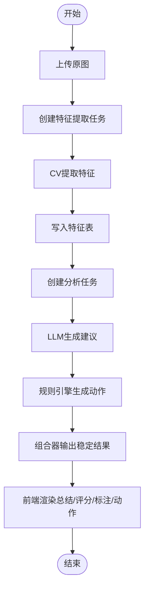
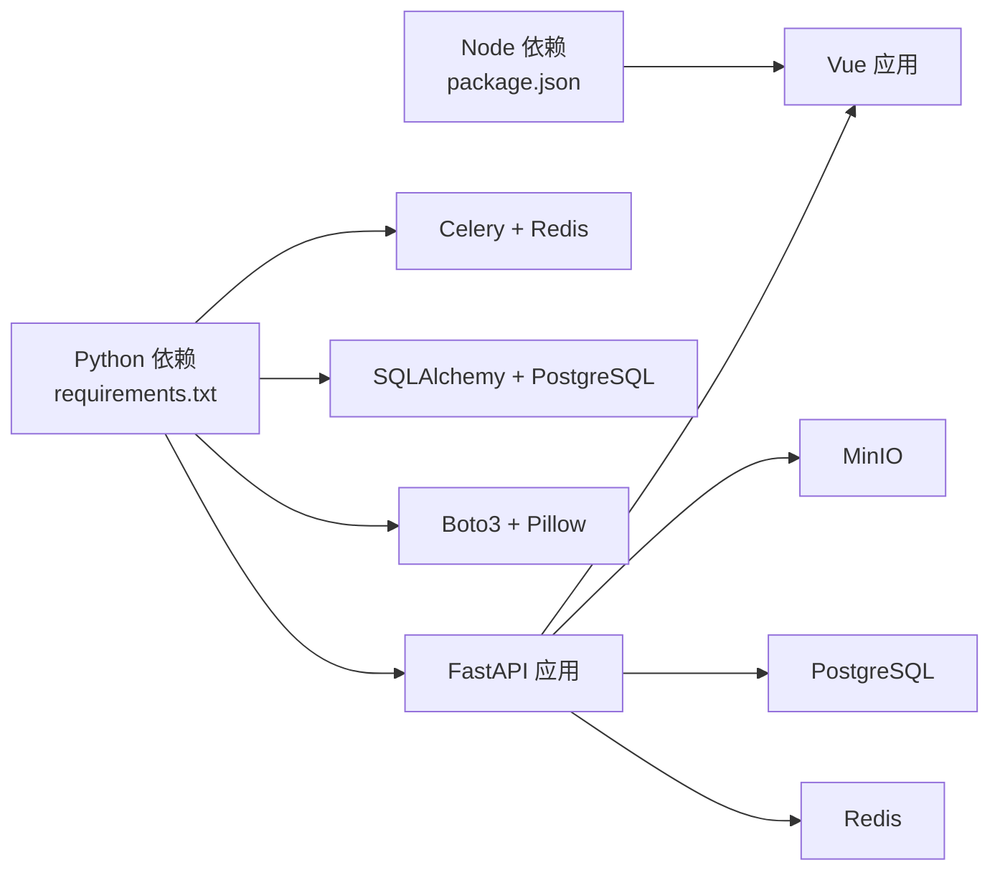

# 项目介绍

<cite>
**本文引用的文件**
- [apps/api/app/main.py](file://apps/api/app/main.py)
- [apps/api/Dockerfile](file://apps/api/Dockerfile)
- [apps/api/requirements.txt](file://apps/api/requirements.txt)
- [apps/web/Dockerfile](file://apps/web/Dockerfile)
- [apps/web/package.json](file://apps/web/package.json)
- [docs/architecture-v2.md](file://docs/architecture-v2.md)
- [apps/api/app/models/user.py](file://apps/api/app/models/user.py)
- [apps/api/app/models/image_asset.py](file://apps/api/app/models/image_asset.py)
- [apps/api/app/models/analysis_task.py](file://apps/api/app/models/analysis_task.py)
- [apps/api/app/schemas/auth.py](file://apps/api/app/schemas/auth.py)
- [apps/api/app/schemas/user.py](file://apps/api/app/schemas/user.py)
- [apps/api/app/modules/images/router.py](file://apps/api/app/modules/images/router.py)
- [apps/api/app/modules/auth/router.py](file://apps/api/app/modules/auth/router.py)
- [apps/api/app/services/ai/analyzer.py](file://apps/api/app/services/ai/analyzer.py)
- [apps/api/app/services/cv/feature_extractor.py](file://apps/api/app/services/cv/feature_extractor.py)
- [apps/web/src/views/HomeView.vue](file://apps/web/src/views/HomeView.vue)
- [apps/web/src/views/LoginView.vue](file://apps/web/src/views/LoginView.vue)
</cite>

## 目录
1. [引言](#引言)
2. [项目结构](#项目结构)
3. [核心组件](#核心组件)
4. [架构总览](#架构总览)
5. [详细组件分析](#详细组件分析)
6. [依赖关系分析](#依赖关系分析)
7. [性能考虑](#性能考虑)
8. [故障排查指南](#故障排查指南)
9. [结论](#结论)
10. [附录](#附录)

## 引言
AI摄影教练是一个面向普通用户的AI摄影指导与分析平台。它通过上传照片、异步任务处理与AI分析，为用户提供摄影技巧点评、构图建议、曝光与色彩评分，并逐步引入自动修图与前后对比能力。项目采用前后端分离架构：后端基于FastAPI提供REST API，前端基于Vue 3构建移动端H5界面；通过Celery与Redis实现异步任务编排，PostgreSQL存储用户与资产数据，MinIO对象存储保存图片资源。

本项目旨在降低摄影学习门槛，帮助用户快速理解照片优缺点并获得可执行的改进方案，从而提升拍摄水平与作品质量。

## 项目结构
项目采用多仓结构，主要包含三个子工程：
- apps/api：后端API与任务处理，提供认证、图片上传、分析任务管理与AI分析服务接口。
- apps/web：前端Vue应用，提供上传、分析、历史与个人中心等页面。
- apps/worker：异步Worker镜像（Dockerfile），用于执行CV、LLM与规则引擎任务。
- docs：架构文档，定义了清晰的分层、协议与演进路径。
- infra：部署与Nginx配置，支持生产环境一键部署。
- packages/contracts：前后端稳定协议Schema，保证结果与标注格式一致。

图表来源
- [apps/api/app/main.py:1-36](file://apps/api/app/main.py#L1-L36)
- [apps/api/app/modules/auth/router.py:1-93](file://apps/api/app/modules/auth/router.py#L1-L93)
- [apps/api/app/modules/images/router.py:1-77](file://apps/api/app/modules/images/router.py#L1-L77)
- [apps/api/app/services/ai/analyzer.py:1-27](file://apps/api/app/services/ai/analyzer.py#L1-L27)
- [apps/api/app/services/cv/feature_extractor.py:1-98](file://apps/api/app/services/cv/feature_extractor.py#L1-L98)
- [apps/api/Dockerfile:1-23](file://apps/api/Dockerfile#L1-L23)
- [apps/web/Dockerfile:1-22](file://apps/web/Dockerfile#L1-L22)

章节来源
- [apps/api/app/main.py:1-36](file://apps/api/app/main.py#L1-L36)
- [apps/api/Dockerfile:1-23](file://apps/api/Dockerfile#L1-L23)
- [apps/web/Dockerfile:1-22](file://apps/web/Dockerfile#L1-L22)
- [docs/architecture-v2.md:73-105](file://docs/architecture-v2.md#L73-L105)

## 核心组件
- 用户认证与资料
  - 提供注册、登录、刷新令牌、邮箱验证、忘记/重置密码等能力，支持密码与OAuth场景。
  - 用户资料包含邮箱、昵称、头像、是否已验证等字段。
- 图片资产管理
  - 支持原图上传、缩略图/预览/编辑衍生图管理，统一存储在MinIO，数据库记录元数据与EXIF。
- 异步分析任务
  - 任务模型支持类型、状态、幂等键、尝试次数与错误信息，便于可靠重试与追踪。
- AI分析流水线
  - CV提取图像特征（主体、地平线、高光/阴影区域、亮度/对比度等）。
  - LLM生成结构化建议与评分。
  - 规则引擎生成可执行编辑动作（裁剪、曝光、白平衡等）。
  - 结果组合器输出稳定协议，供前端渲染与后续自动修图使用。

章节来源
- [apps/api/app/modules/auth/router.py:1-93](file://apps/api/app/modules/auth/router.py#L1-L93)
- [apps/api/app/schemas/auth.py:1-37](file://apps/api/app/schemas/auth.py#L1-L37)
- [apps/api/app/schemas/user.py:1-30](file://apps/api/app/schemas/user.py#L1-L30)
- [apps/api/app/models/user.py:1-28](file://apps/api/app/models/user.py#L1-L28)
- [apps/api/app/models/image_asset.py:1-32](file://apps/api/app/models/image_asset.py#L1-L32)
- [apps/api/app/models/analysis_task.py:1-36](file://apps/api/app/models/analysis_task.py#L1-L36)
- [apps/api/app/modules/images/router.py:1-77](file://apps/api/app/modules/images/router.py#L1-L77)
- [apps/api/app/services/ai/analyzer.py:1-27](file://apps/api/app/services/ai/analyzer.py#L1-L27)
- [apps/api/app/services/cv/feature_extractor.py:1-98](file://apps/api/app/services/cv/feature_extractor.py#L1-L98)

## 架构总览
项目采用“前端H5 + 后端API + 异步Worker + 存储”的分层架构。前端通过HTTP与后端交互，后端负责参数校验、任务创建与查询、结果返回；异步Worker执行CV/LLM/规则引擎任务；数据库与对象存储分别承载结构化数据与二进制资源。

图表来源
- [docs/architecture-v2.md:27-71](file://docs/architecture-v2.md#L27-L71)
- [apps/api/requirements.txt:1-19](file://apps/api/requirements.txt#L1-L19)

## 详细组件分析

### 前端组件分析
- 首页视图（上传与分析）
  - 支持选择图片、本地预览、创建分析任务、轮询任务状态、展示AI点评与建议。
  - 状态提示直观，失败时可重试。
- 登录视图
  - 表单校验邮箱与密码，调用后端认证接口，成功后拉取用户资料并跳转首页。

图表来源
- [apps/web/src/views/HomeView.vue:1-111](file://apps/web/src/views/HomeView.vue#L1-L111)
- [apps/api/app/modules/images/router.py:1-77](file://apps/api/app/modules/images/router.py#L1-L77)
- [apps/api/app/main.py:1-36](file://apps/api/app/main.py#L1-L36)

章节来源
- [apps/web/src/views/HomeView.vue:1-111](file://apps/web/src/views/HomeView.vue#L1-L111)
- [apps/web/src/views/LoginView.vue:1-127](file://apps/web/src/views/LoginView.vue#L1-L127)

### 后端组件分析
- 应用入口与路由
  - 注册CORS，挂载认证、图片、分析、用户模块路由，启动时初始化数据库。
- 认证模块
  - 提供注册、登录、刷新、登出、邮箱验证、忘记/重置密码等端点。
- 图片模块
  - 校验图片类型与尺寸，读取宽高，生成对象键，上传至MinIO，入库记录元数据。
- AI分析门面
  - 协调CV特征提取、LLM建议生成、规则引擎动作规划与结果组合器输出。

图表来源
- [apps/api/app/services/ai/analyzer.py:1-27](file://apps/api/app/services/ai/analyzer.py#L1-L27)
- [apps/api/app/services/cv/feature_extractor.py:1-98](file://apps/api/app/services/cv/feature_extractor.py#L1-L98)
- [apps/api/app/modules/auth/router.py:1-93](file://apps/api/app/modules/auth/router.py#L1-L93)
- [apps/api/app/models/image_asset.py:1-32](file://apps/api/app/models/image_asset.py#L1-L32)
- [apps/api/app/models/analysis_task.py:1-36](file://apps/api/app/models/analysis_task.py#L1-L36)

章节来源
- [apps/api/app/main.py:1-36](file://apps/api/app/main.py#L1-L36)
- [apps/api/app/modules/auth/router.py:1-93](file://apps/api/app/modules/auth/router.py#L1-L93)
- [apps/api/app/modules/images/router.py:1-77](file://apps/api/app/modules/images/router.py#L1-L77)
- [apps/api/app/services/ai/analyzer.py:1-27](file://apps/api/app/services/ai/analyzer.py#L1-L27)
- [apps/api/app/services/cv/feature_extractor.py:1-98](file://apps/api/app/services/cv/feature_extractor.py#L1-L98)

### 处理流程与协议
- 处理流程
  - 上传原图 → 创建特征提取任务 → 写入特征 → 创建分析任务 → LLM生成建议 → 规则引擎生成动作 → 组合器输出稳定结果。
- 稳定结果协议
  - 包含版本、摘要、建议列表、评分、特征引用、标注与可执行编辑动作，前端仅做渲染与交互。
- 标注协议
  - 明确几何类型（bbox/point/line/polygon）与来源（CV/LLM/Rule），坐标使用原图像素坐标系。
- 编辑动作协议
  - 动作为可执行对象（裁剪、曝光、白平衡等），包含原因、预览性与破坏性等属性。

图表来源
- [docs/architecture-v2.md:350-362](file://docs/architecture-v2.md#L350-L362)
- [docs/architecture-v2.md:239-269](file://docs/architecture-v2.md#L239-L269)
- [docs/architecture-v2.md:277-319](file://docs/architecture-v2.md#L277-L319)
- [docs/architecture-v2.md:320-349](file://docs/architecture-v2.md#L320-L349)

章节来源
- [docs/architecture-v2.md:350-362](file://docs/architecture-v2.md#L350-L362)
- [docs/architecture-v2.md:239-269](file://docs/architecture-v2.md#L239-L269)
- [docs/architecture-v2.md:277-319](file://docs/architecture-v2.md#L277-L319)
- [docs/architecture-v2.md:320-349](file://docs/architecture-v2.md#L320-L349)

## 依赖关系分析
- 技术栈
  - 后端：FastAPI、SQLAlchemy、Celery、Redis、PostgreSQL、Boto3(Pillow)、Pydantic。
  - 前端：Vue 3、Pinia、Vue Router、Axios。
  - 部署：Docker、Nginx、docker-compose。
- 组件耦合
  - API层与Worker层解耦，通过Redis队列通信；存储与数据库独立扩展。
  - CV/LLM/规则引擎通过门面协调，便于替换与演进。

图表来源
- [apps/api/requirements.txt:1-19](file://apps/api/requirements.txt#L1-L19)
- [apps/web/package.json:1-26](file://apps/web/package.json#L1-L26)
- [apps/api/Dockerfile:1-23](file://apps/api/Dockerfile#L1-L23)
- [apps/web/Dockerfile:1-22](file://apps/web/Dockerfile#L1-L22)

章节来源
- [apps/api/requirements.txt:1-19](file://apps/api/requirements.txt#L1-L19)
- [apps/web/package.json:1-26](file://apps/web/package.json#L1-L26)

## 性能考虑
- 异步化与幂等
  - 使用任务模型与幂等键避免重复执行，失败重试与状态追踪提升可靠性。
- 缓存与并发
  - CV特征提取与AI分析门面使用缓存，减少重复计算。
- 存储与网络
  - 图片上传采用流式读取与对象存储，避免内存峰值；前端按需加载与懒渲染优化体验。
- 数据库索引
  - 任务表按用户与时间建立索引，提升查询效率。

## 故障排查指南
- 常见问题定位
  - 上传失败：检查文件类型、大小限制与对象存储连接。
  - 认证异常：确认邮箱验证流程与令牌刷新逻辑。
  - 任务卡住：查看任务状态与错误码，结合日志定位Worker执行情况。
- 建议排查步骤
  - 前端：确认API基础URL与路由正确，观察状态提示与错误信息。
  - 后端：查看健康检查端点、数据库连接与Redis队列状态。
  - 存储：验证MinIO桶权限与对象键命名规则。

章节来源
- [apps/api/app/modules/images/router.py:1-77](file://apps/api/app/modules/images/router.py#L1-L77)
- [apps/api/app/modules/auth/router.py:1-93](file://apps/api/app/modules/auth/router.py#L1-L93)
- [apps/api/app/main.py:32-36](file://apps/api/app/main.py#L32-L36)

## 结论
AI摄影教练通过清晰的分层架构与稳定协议，实现了从图片上传到AI分析再到可执行动作的完整闭环。项目具备良好的扩展性与演进路径，能够持续引入更丰富的摄影指导能力，并逐步完善自动修图与成长体系，帮助不同层次的用户提升摄影技能与创作效率。

## 附录
- 应用场景与目标用户
  - 场景：日常旅行、人像、街拍、风景等摄影学习与提升。
  - 用户：摄影初学者、爱好者、创作者与对图像质量有要求的普通用户。
- 核心价值
  - 降低学习成本：提供即时反馈与可执行建议。
  - 提升效率：自动评分与标注帮助快速定位问题。
  - 可靠性：异步任务与稳定协议保障分析一致性与可追溯性。
- 愿景与规划
  - 短期：完善上传、分析与建议展示，引入标注与评分。
  - 中期：实现自动裁剪、曝光与白平衡等可执行动作。
  - 长期：引入风格识别、成长系统、多图对比与社交分享。