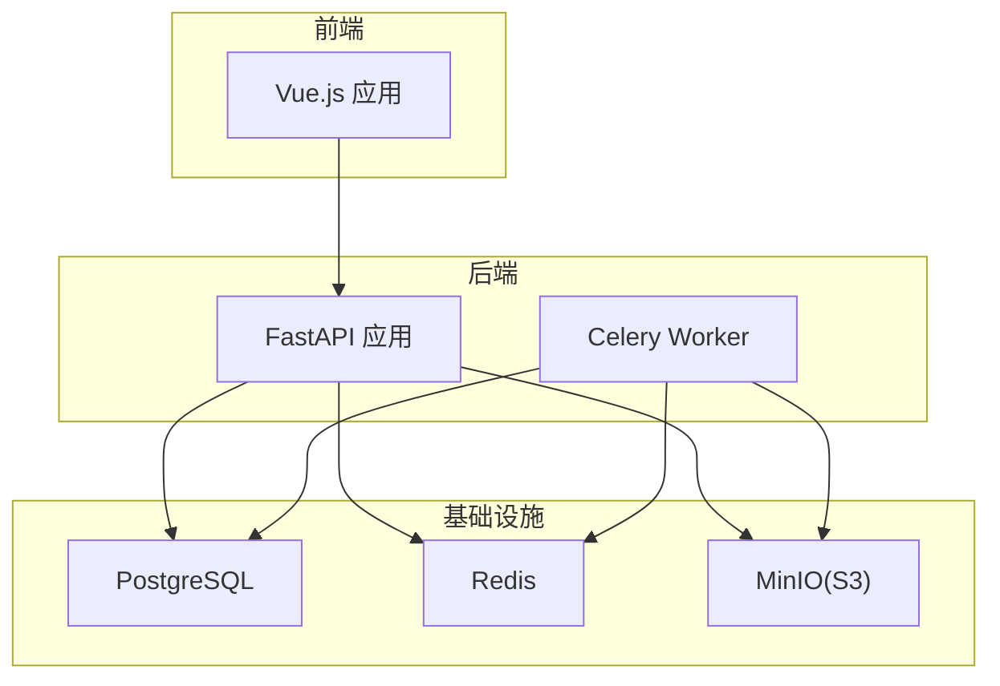
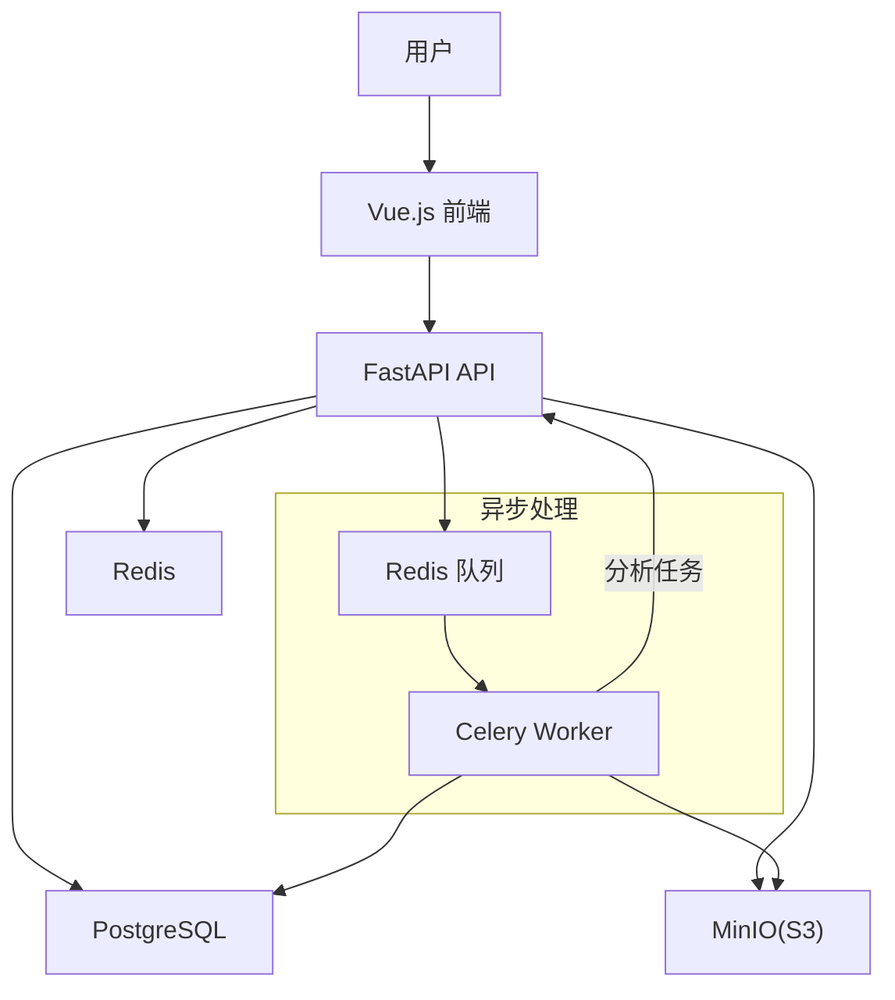
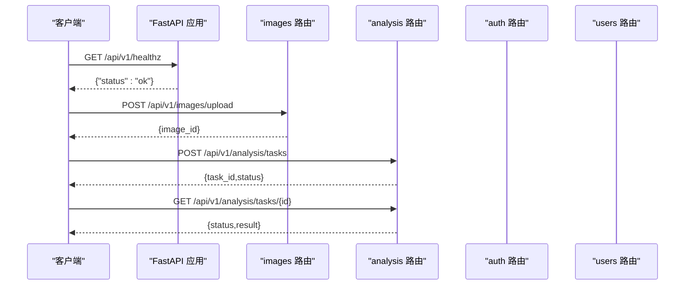
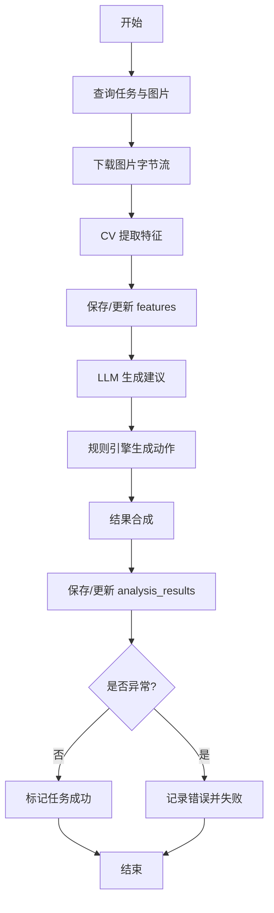
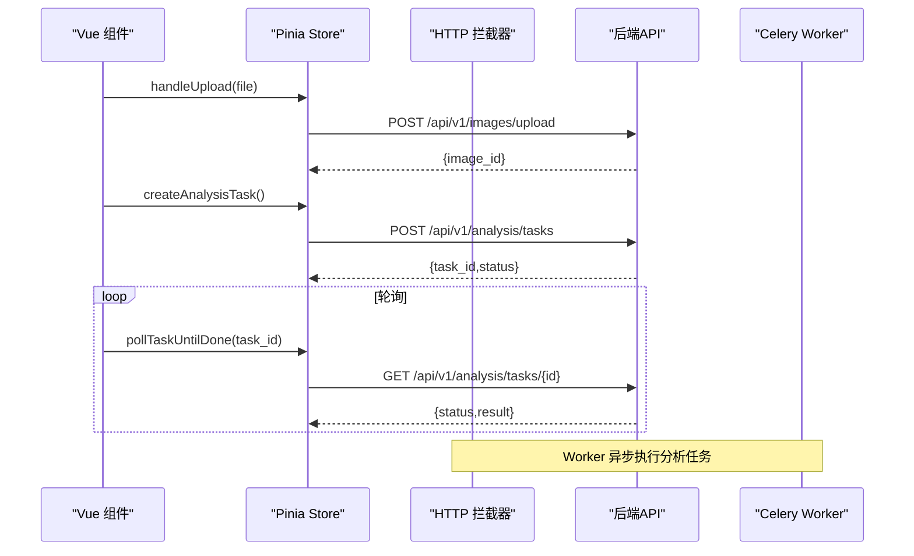
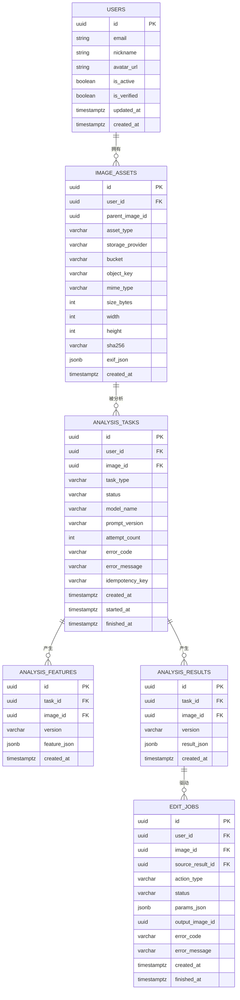
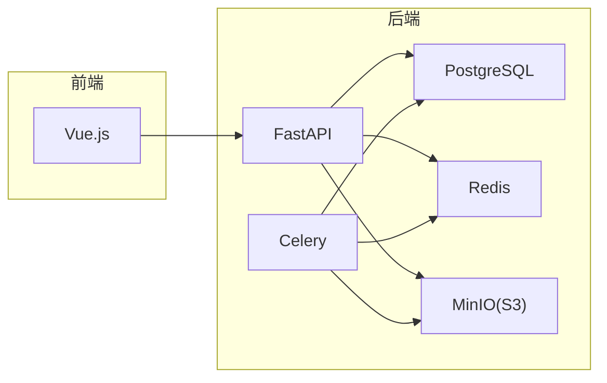

# 项目概述

<cite>
**本文引用的文件**
- [apps/api/app/main.py](file://apps/api/app/main.py)
- [apps/api/app/core/config.py](file://apps/api/app/core/config.py)
- [apps/api/app/core/database.py](file://apps/api/app/core/database.py)
- [apps/api/app/core/celery_app.py](file://apps/api/app/core/celery_app.py)
- [apps/api/app/models/base.py](file://apps/api/app/models/base.py)
- [apps/api/app/tasks/analyze_photo.py](file://apps/api/app/tasks/analyze_photo.py)
- [apps/api/requirements.txt](file://apps/api/requirements.txt)
- [apps/api/Dockerfile](file://apps/api/Dockerfile)
- [apps/worker/Dockerfile](file://apps/worker/Dockerfile)
- [apps/web/src/main.ts](file://apps/web/src/main.ts)
- [apps/web/src/router.ts](file://apps/web/src/router.ts)
- [apps/web/src/stores/auth.ts](file://apps/web/src/stores/auth.ts)
- [apps/web/src/stores/analysis.ts](file://apps/web/src/stores/analysis.ts)
- [apps/web/src/api/http.ts](file://apps/web/src/api/http.ts)
- [apps/web/src/views/HomeView.vue](file://apps/web/src/views/HomeView.vue)
- [apps/web/package.json](file://apps/web/package.json)
- [apps/web/Dockerfile](file://apps/web/Dockerfile)
- [infra/docker-compose.yml](file://infra/docker-compose.yml)
- [docs/architecture-v2.md](file://docs/architecture-v2.md)
</cite>

## 目录
1. [引言](#引言)
2. [项目结构](#项目结构)
3. [核心组件](#核心组件)
4. [架构总览](#架构总览)
5. [详细组件分析](#详细组件分析)
6. [依赖分析](#依赖分析)
7. [性能考虑](#性能考虑)
8. [故障排查指南](#故障排查指南)
9. [结论](#结论)
10. [附录](#附录)

## 引言
AI摄影教练是一个面向摄影学习者的智能分析与指导平台。它通过上传照片，异步触发分析任务，结合计算机视觉（CV）事实、大语言模型（LLM）解释与规则引擎动作，为用户提供结构化的点评、评分与可执行的编辑建议。项目采用前后端分离架构：后端基于FastAPI提供REST API与Celery异步任务；前端基于Vue.js与TypeScript构建，使用Pinia进行状态管理，Axios封装HTTP请求与鉴权拦截。

业务价值与场景：
- 摄影指导：提供结构化点评与建议，帮助用户提升构图、曝光、色彩等摄影技巧。
- AI分析：通过CV与LLM融合，输出稳定的分析结果与标注协议。
- 用户管理：基础的认证与会话管理，支持令牌刷新与路由守卫。
- 可扩展性：清晰的任务类型与数据模型，便于后续接入自动修图与成长体系。

## 项目结构
项目采用多仓（multi-service）布局，包含三个主要容器化服务：
- API服务：提供REST接口、数据库初始化与CORS配置。
- Worker服务：运行Celery工作进程，消费分析队列任务。
- Web前端：构建静态资源并通过Nginx对外提供。

图表来源
- [infra/docker-compose.yml:1-107](file://infra/docker-compose.yml#L1-L107)
- [apps/api/app/main.py:1-36](file://apps/api/app/main.py#L1-L36)
- [apps/api/app/core/celery_app.py:1-21](file://apps/api/app/core/celery_app.py#L1-L21)

章节来源
- [apps/api/app/main.py:1-36](file://apps/api/app/main.py#L1-L36)
- [apps/api/app/core/config.py:1-47](file://apps/api/app/core/config.py#L1-L47)
- [apps/api/app/core/database.py:1-51](file://apps/api/app/core/database.py#L1-L51)
- [apps/api/app/core/celery_app.py:1-21](file://apps/api/app/core/celery_app.py#L1-L21)
- [apps/api/app/models/base.py:1-5](file://apps/api/app/models/base.py#L1-L5)
- [apps/api/app/tasks/analyze_photo.py:1-108](file://apps/api/app/tasks/analyze_photo.py#L1-L108)
- [apps/api/requirements.txt:1-19](file://apps/api/requirements.txt#L1-L19)
- [apps/api/Dockerfile:1-23](file://apps/api/Dockerfile#L1-L23)
- [apps/worker/Dockerfile:1-20](file://apps/worker/Dockerfile#L1-L20)
- [apps/web/src/main.ts:1-14](file://apps/web/src/main.ts#L1-L14)
- [apps/web/src/router.ts:1-30](file://apps/web/src/router.ts#L1-L30)
- [apps/web/src/stores/auth.ts:1-41](file://apps/web/src/stores/auth.ts#L1-L41)
- [apps/web/src/stores/analysis.ts:1-142](file://apps/web/src/stores/analysis.ts#L1-L142)
- [apps/web/src/api/http.ts:1-94](file://apps/web/src/api/http.ts#L1-L94)
- [apps/web/src/views/HomeView.vue:1-111](file://apps/web/src/views/HomeView.vue#L1-L111)
- [apps/web/package.json:1-26](file://apps/web/package.json#L1-L26)
- [apps/web/Dockerfile:1-22](file://apps/web/Dockerfile#L1-L22)
- [infra/docker-compose.yml:1-107](file://infra/docker-compose.yml#L1-L107)
- [docs/architecture-v2.md:1-424](file://docs/architecture-v2.md#L1-L424)

## 核心组件
- FastAPI后端
  - 路由注册：图像、分析、认证、用户模块。
  - 中间件：CORS跨域配置。
  - 启动事件：数据库初始化与增量模式更新。
- Celery异步任务
  - 任务定义：分析任务入口。
  - 队列路由：分析任务进入analysis队列。
- 数据模型与存储
  - SQLAlchemy基类与会话管理。
  - 存储抽象：S3兼容对象存储下载。
- Vue.js前端
  - 应用入口：挂载Pinia与路由。
  - 路由守卫：登录/注册页仅访客可见，其他页面需登录。
  - 状态管理：认证令牌与用户信息，分析任务状态轮询。
  - HTTP拦截：自动注入Bearer Token与401刷新逻辑。

章节来源
- [apps/api/app/main.py:1-36](file://apps/api/app/main.py#L1-L36)
- [apps/api/app/core/database.py:1-51](file://apps/api/app/core/database.py#L1-L51)
- [apps/api/app/core/celery_app.py:1-21](file://apps/api/app/core/celery_app.py#L1-L21)
- [apps/api/app/tasks/analyze_photo.py:1-108](file://apps/api/app/tasks/analyze_photo.py#L1-L108)
- [apps/api/app/models/base.py:1-5](file://apps/api/app/models/base.py#L1-L5)
- [apps/web/src/main.ts:1-14](file://apps/web/src/main.ts#L1-L14)
- [apps/web/src/router.ts:1-30](file://apps/web/src/router.ts#L1-L30)
- [apps/web/src/stores/auth.ts:1-41](file://apps/web/src/stores/auth.ts#L1-L41)
- [apps/web/src/stores/analysis.ts:1-142](file://apps/web/src/stores/analysis.ts#L1-L142)
- [apps/web/src/api/http.ts:1-94](file://apps/web/src/api/http.ts#L1-L94)

## 架构总览
系统遵循“CV产出事实、LLM产出解释、规则引擎产出可执行动作”的分层原则，通过异步任务链路串联各服务，并以统一的结果协议输出给前端。

图表来源
- [docs/architecture-v2.md:1-424](file://docs/architecture-v2.md#L1-L424)
- [apps/api/app/core/celery_app.py:1-21](file://apps/api/app/core/celery_app.py#L1-L21)
- [apps/api/app/tasks/analyze_photo.py:1-108](file://apps/api/app/tasks/analyze_photo.py#L1-L108)
- [infra/docker-compose.yml:1-107](file://infra/docker-compose.yml#L1-L107)

## 详细组件分析

### 后端应用与路由
- 应用启动：注册CORS、挂载模块路由、启动数据库。
- 模块划分：images、analysis、auth、users四个模块分别提供上传、分析、认证、用户管理能力。
- 健康检查：提供/healthz端点。

图表来源
- [apps/api/app/main.py:1-36](file://apps/api/app/main.py#L1-L36)
- [apps/api/app/modules/images/router.py](file://apps/api/app/modules/images/router.py)
- [apps/api/app/modules/analysis/router.py](file://apps/api/app/modules/analysis/router.py)
- [apps/api/app/modules/auth/router.py](file://apps/api/app/modules/auth/router.py)
- [apps/api/app/modules/users/router.py](file://apps/api/app/modules/users/router.py)

章节来源
- [apps/api/app/main.py:1-36](file://apps/api/app/main.py#L1-L36)

### 异步分析任务流程
- 任务入口：run_analysis_task接收task_id，查询任务与图片。
- 下载图片：从S3兼容存储下载二进制。
- 特征提取：调用CV服务提取特征并持久化至analysis_features。
- LLM分析：基于特征生成结构化建议。
- 规则动作：根据建议生成可执行编辑动作。
- 结果合成：统一输出稳定协议写入analysis_results。
- 状态更新：成功/失败状态与错误信息回写任务记录。

图表来源
- [apps/api/app/tasks/analyze_photo.py:1-108](file://apps/api/app/tasks/analyze_photo.py#L1-L108)

章节来源
- [apps/api/app/tasks/analyze_photo.py:1-108](file://apps/api/app/tasks/analyze_photo.py#L1-L108)

### 前端状态与交互
- 应用初始化：创建Pinia与路由，全局样式。
- 路由守卫：未登录访问受保护路由跳转登录；已登录访问登录/注册页跳转首页。
- 认证状态：本地存储令牌，提供setTokens/clearAuth/setUser。
- 分析流程：上传图片→创建任务→轮询状态→展示结果；失败可重试。
- HTTP拦截：请求注入Bearer Token；响应401触发刷新流程。

图表来源
- [apps/web/src/stores/analysis.ts:1-142](file://apps/web/src/stores/analysis.ts#L1-L142)
- [apps/web/src/api/http.ts:1-94](file://apps/web/src/api/http.ts#L1-L94)
- [apps/web/src/views/HomeView.vue:1-111](file://apps/web/src/views/HomeView.vue#L1-L111)

章节来源
- [apps/web/src/main.ts:1-14](file://apps/web/src/main.ts#L1-L14)
- [apps/web/src/router.ts:1-30](file://apps/web/src/router.ts#L1-L30)
- [apps/web/src/stores/auth.ts:1-41](file://apps/web/src/stores/auth.ts#L1-L41)
- [apps/web/src/stores/analysis.ts:1-142](file://apps/web/src/stores/analysis.ts#L1-L142)
- [apps/web/src/api/http.ts:1-94](file://apps/web/src/api/http.ts#L1-L94)
- [apps/web/src/views/HomeView.vue:1-111](file://apps/web/src/views/HomeView.vue#L1-L111)

### 数据模型与关系
- users：用户基本信息。
- image_assets：原图、缩略图、预览图、编辑结果等资产类型与父子关系。
- analysis_tasks：任务类型、幂等键、尝试次数与状态。
- analysis_features：CV特征版本与JSON。
- analysis_results：统一结果协议版本与JSON。
- edit_jobs：编辑作业（按计划引入）。

图表来源
- [docs/architecture-v2.md:107-238](file://docs/architecture-v2.md#L107-L238)

章节来源
- [docs/architecture-v2.md:107-238](file://docs/architecture-v2.md#L107-L238)

## 依赖分析
- 技术栈与选择理由
  - FastAPI：高性能异步框架，自动生成OpenAPI文档，适合API优先的后端。
  - Celery + Redis：异步任务编排与队列，支持任务路由与失败重试。
  - PostgreSQL：关系型数据库，事务一致性强，适合用户与任务数据。
  - MinIO（S3兼容）：对象存储，适配图片原图、派生图与编辑结果。
  - Vue.js + TypeScript：渐进式前端框架，生态完善，适合H5移动端。
  - Nginx：静态资源服务与健康检查。
- 外部依赖与集成点
  - 对象存储：S3_ENDPOINT、S3_ACCESS_KEY、S3_SECRET_KEY、S3_BUCKET。
  - 认证：JWT密钥、算法与过期策略。
  - CORS：允许的源列表动态配置。

图表来源
- [apps/api/requirements.txt:1-19](file://apps/api/requirements.txt#L1-L19)
- [apps/web/package.json:1-26](file://apps/web/package.json#L1-L26)
- [apps/api/app/core/config.py:1-47](file://apps/api/app/core/config.py#L1-L47)
- [apps/api/app/core/celery_app.py:1-21](file://apps/api/app/core/celery_app.py#L1-L21)

章节来源
- [apps/api/requirements.txt:1-19](file://apps/api/requirements.txt#L1-L19)
- [apps/web/package.json:1-26](file://apps/web/package.json#L1-L26)
- [apps/api/app/core/config.py:1-47](file://apps/api/app/core/config.py#L1-L47)
- [apps/api/app/core/celery_app.py:1-21](file://apps/api/app/core/celery_app.py#L1-L21)

## 性能考虑
- 异步化：分析任务通过Celery异步执行，避免阻塞API响应。
- 轮询策略：前端采用固定间隔轮询任务状态，建议根据实际耗时优化轮询频率。
- 存储与缓存：Redis用于任务中间状态与结果缓存，S3用于大文件存储，注意网络抖动与超时设置。
- 数据库：连接池与索引（如任务类型+时间索引）有助于查询性能。
- 前端：图片预览使用浏览器URL对象，及时释放内存；避免重复上传与无效轮询。

## 故障排查指南
- 常见问题定位
  - API无法访问：检查/healthz健康检查与CORS配置。
  - 任务不执行：确认Redis可用、Worker容器启动、队列路由正确。
  - 401/403：检查本地存储的access_token与refresh_token，确认刷新流程是否成功。
  - 数据库迁移：确认增量更新SQL已执行，表结构与索引存在。
- 关键日志与断点
  - API启动日志：数据库初始化与模块路由注册。
  - Worker日志：任务状态变更、异常堆栈与错误码。
  - 前端日志：请求拦截器中的刷新流程与错误提示。

章节来源
- [apps/api/app/main.py:27-36](file://apps/api/app/main.py#L27-L36)
- [apps/api/app/core/celery_app.py:16-19](file://apps/api/app/core/celery_app.py#L16-L19)
- [apps/web/src/api/http.ts:37-91](file://apps/web/src/api/http.ts#L37-L91)
- [apps/api/app/core/database.py:28-51](file://apps/api/app/core/database.py#L28-L51)

## 结论
AI摄影教练项目以清晰的分层与协议为核心，结合FastAPI、Celery、PostgreSQL与Vue.js，构建了可扩展的摄影分析与指导平台。通过CV、LLM与规则引擎的解耦，项目具备良好的演进空间，可在后续阶段逐步引入自动修图、成长体系与风格识别等功能。

## 附录

### 快速开始
- 环境准备
  - 安装Docker与docker-compose。
  - 准备环境变量（参考配置文件与compose文件中的默认值）。
- 启动服务
  - 在根目录执行docker-compose，等待所有服务健康。
  - 前端默认监听80端口，后端API监听8000端口。
- 访问与测试
  - 前端：浏览器打开http://localhost或http://127.0.0.1。
  - API：访问http://localhost:8000/api/v1/healthz。
  - 登录/注册：使用认证模块提供的接口进行登录与令牌刷新。

章节来源
- [infra/docker-compose.yml:1-107](file://infra/docker-compose.yml#L1-L107)
- [apps/api/Dockerfile:1-23](file://apps/api/Dockerfile#L1-L23)
- [apps/worker/Dockerfile:1-20](file://apps/worker/Dockerfile#L1-L20)
- [apps/web/Dockerfile:1-22](file://apps/web/Dockerfile#L1-L22)

### 基本使用示例（路径指引）
- 上传图片
  - 前端：HomeView中选择文件并触发上传。
  - 后端：images模块路由提供上传接口。
  - 路径参考：[apps/web/src/views/HomeView.vue:31-36](file://apps/web/src/views/HomeView.vue#L31-L36)、[apps/api/app/modules/images/router.py](file://apps/api/app/modules/images/router.py)
- 创建分析任务
  - 前端：点击“开始分析”触发任务创建与轮询。
  - 后端：analysis模块路由提供任务创建与状态查询。
  - 路径参考：[apps/web/src/stores/analysis.ts:55-74](file://apps/web/src/stores/analysis.ts#L55-L74)、[apps/api/app/modules/analysis/router.py](file://apps/api/app/modules/analysis/router.py)
- 认证与会话
  - 前端：登录后存储令牌，请求自动注入Authorization。
  - 后端：CORS与JWT配置。
  - 路径参考：[apps/web/src/api/http.ts:10-17](file://apps/web/src/api/http.ts#L10-L17)、[apps/api/app/core/config.py:30-35](file://apps/api/app/core/config.py#L30-L35)